# “AMS” 前端开发手册


## 1. 简介

AMS是一个博客后台权限管理系统。

可管理三种用户：

- 主人：拥有所有权限（增删改查）
- 游客：只有查看权限
- 登录用户：用于查看权限和部分编辑功能

技术栈：

- Vue

开发环境：

- windows10


下面开始开发啦！


## 2. 创建新项目，搭建基础环境

需要安装的东西：

- Node.js：是一个基于Chrome V8引擎的[JavaScript](https://baike.baidu.com/item/JavaScript/321142)运行环境
- NPM：是随同NodeJS一起安装的包管理工具，能解决NodeJS代码部署上的很多问题
- Node.js 淘宝镜像加速器（cnpm）：简单理解为npm的备用版本
- vue-cli：这里安装3以上的版本，可以使用vue-ui可视化窗口
- IDEA安装vue插件
- Element-ui：UI组件库，类似BootStrap
- axios：一个基于 promise 的 HTTP 库，类ajax。进行前后端对接的时候，使用这个工具可以提高我们的开发效率
- qs：查询参数序列化和解析库
- mockjs：为我们生成随机数据的工具库
- vue-router：vue路由，用于页面之间的交互连接

------

### 2.1 安装Node.js及NPM

由于新版的nodejs已经集成了npm，所以安装NodeJS的同时NPN也一并安装好了。

1. 官网`http://nodejs.cn/download`下载64位安装包，无脑安装即可。

2. cmd下输入 `node -v`，查看是否能够正确打印版本号即可，如下图

3. cmd下输入 `npm -v`，查看是否能够正常打印版本号即可，如下图

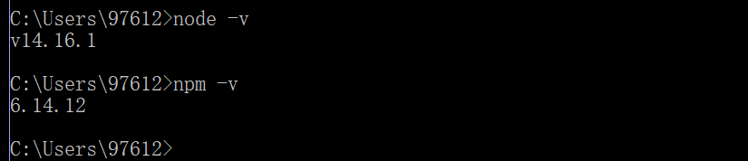


### 2.2 淘宝镜像加速器 cnpm

npm安装插件过程：从[http://registry.npmjs.org](http://registry.npmjs.org/)下载对应的插件包（该网站服务器位于国外，所以经常下载缓慢或出现异常），解决办法就是用cnpm代替。

所以cnpm可以理解为npm的加速版本，出现下载不了的情况时，可以用cnpm代替。

在cmd中输入下面的命令安装（推荐使用第一条命令）：

```cmd
# 推荐：-g 就是全局安装
npm install cnpm -g
# 不推荐：使用如下语句解决npm速度慢的问题(每次安装的时候都带上)
npm install --registry=https://registry.npm.taobao.org
```

安装成功结果如下。划线路径是cnpm的默认安装位置（安装在隐藏目录中）

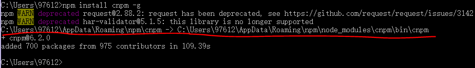


### 2.3 SPSS 加载器

```cmd
# 安装 SPSS 加载器
cnpm install sass-loader node-sass --save-dev
```


### 2.4 安装 vue-cli

Vue CLI官网有安装教程：https://cli.vuejs.org/zh/

安装低版本（3以下的版本）：

```cmd
# cmd下使用下面的命令安装vue-cli：
cnpm install vue-cli -g

# 测试是否安装成功
# 查看可以基于哪些模板创建 vue 应用程序，通常选择 webpack
vue list

# 查看 vue版本：2.9.6
vue -V   

# 查看是否有ui功能。Commands中不含有ui说明vue版本低于3时没有ui功能
vue -h
```

安装最新版本vue-cli 3.0+：

```cmd
# 3卸载老版本
npm uninstall vue-cli -g
# 下载安装3以上的版本用下面的新命令：
npm install -g @vue/cli
# 打开vue ui: 浏览器会弹出一个Vue项目管理器
vue ui
```


### 2.5 创建vue项目

1. 选定目标位置打开cmd：

   `D:\Github\GitRepository\Authority-Management-System`中打开cmd

2. 在目标位置打开vue可视化管理窗口，这样vue ui 和 vue项目就在同一级，方便管理切换：

   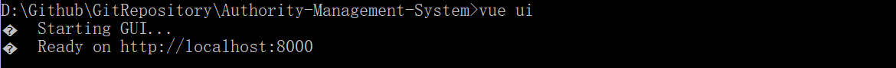

3. 浏览器弹出可视化窗口。在"创建"下确定项目目标位置，然后点击"+在此创建新项目"：

   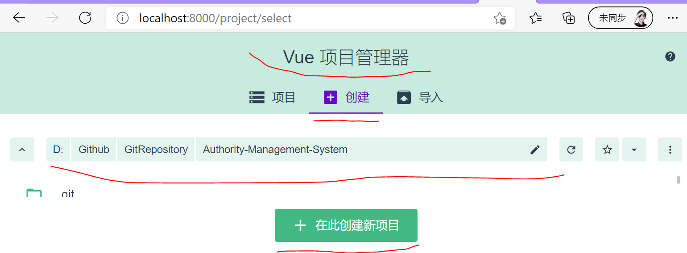

4. 在下图输入项目名字，自己选择相关配置，然后点击下一步

   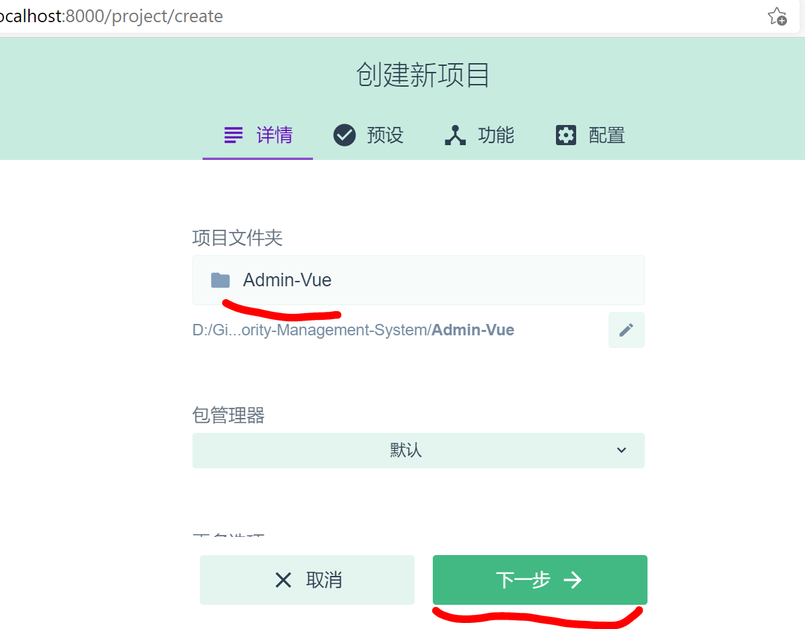

5. 预设中选择手动->下一步

6. 勾选上路由Router、状态管理Vuex，去掉js的校验

   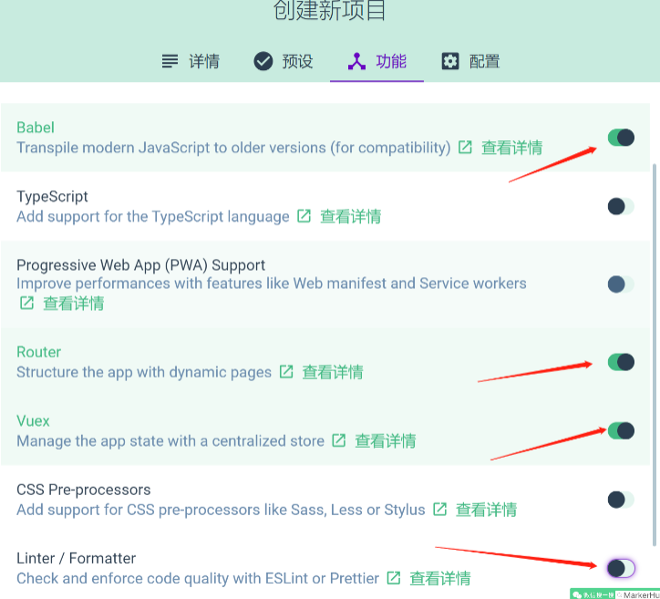

7. 下一步中，选上【Use history mode for router】，点击创建项目->弹窗中选择按钮【创建项目，不保存预设】

8. 等待项目创建完成后。在目标位置下会生成这个新项目。这样我们就创建好基础工程了

   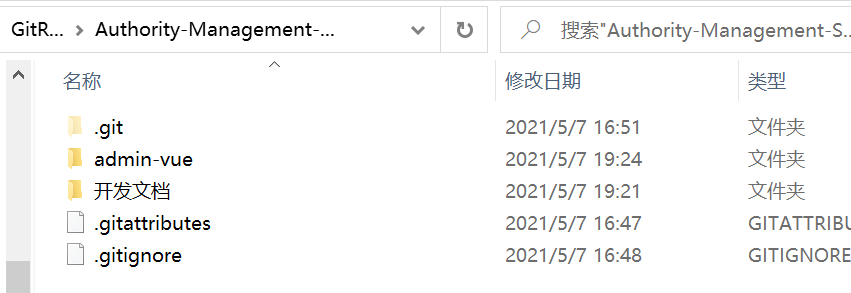

9. admin-vue项目目录说明：

   - `node_modules`：是安装node后用来存放用包管理工具下载安装的包的文件夹。比如webpack、gulp、grunt这些工具。

     npm install 执行完毕后，我们可以在 node_modules 中看到所有依赖的包。

   - `public`：静态资源目录，build之后，public下面的文件会原封不动的添加到dist中，不会被合并、压缩；多用来存放第三方插件。

   - `src`：代码存放路径

     - `assets`：多用来存放业务级的js、css等，如一些全局的scss样式文件、全局的工具类js文件等。
     - `components`：存放通用的组件
     - `router`：存放路由文件
     - `store`：存放 vuex，应用级数据（state）
     - `views`：存放前端页面
     - `app.vue`：使用标签<route-view></router-view>渲染整个工程的.vue组件
     - `main.js`：程序主入口。作用是创建vue实例

   - `package.json`：用于 node_modules资源部 和 启动、打包项目的 npm 命令管理


### 2.6 IDEA安装Vue插件

IDEA要预先先安装好一个Vue插件：

settings->Plugins->搜索vue->安装install


### 2.7 IDEA运行vue

IDEA打开`admin-vue`项目。

在终端Terminal窗口中启动vue项目，输入如下命令：

````cmd
# 3之前的的版本可能是`npm run dev`
# 由于不同版本vue-cli中的package.json中：
# "scripts": {
#   "serve": "vue-cli-service serve",
#   "build": "vue-cli-service build"
# },
# 而 npm run xxx 中的 xxx就是scripts中的键。
# 所以版本不同，vue程序启动的命令也不同
npm run serve  
````

运行成功后终端显示如下：

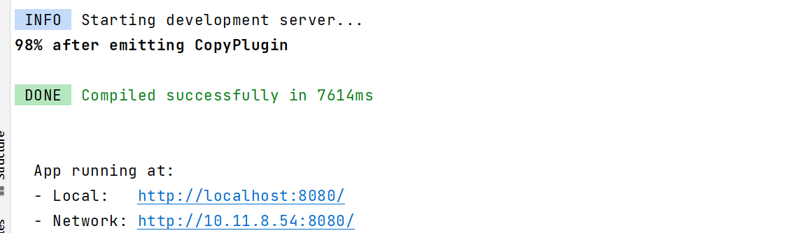


因此，浏览器可以访问上面两个网址查看成功启动的效果：

  - Local:   http://localhost:8080/
  - Network: http://10.11.8.54:8080/

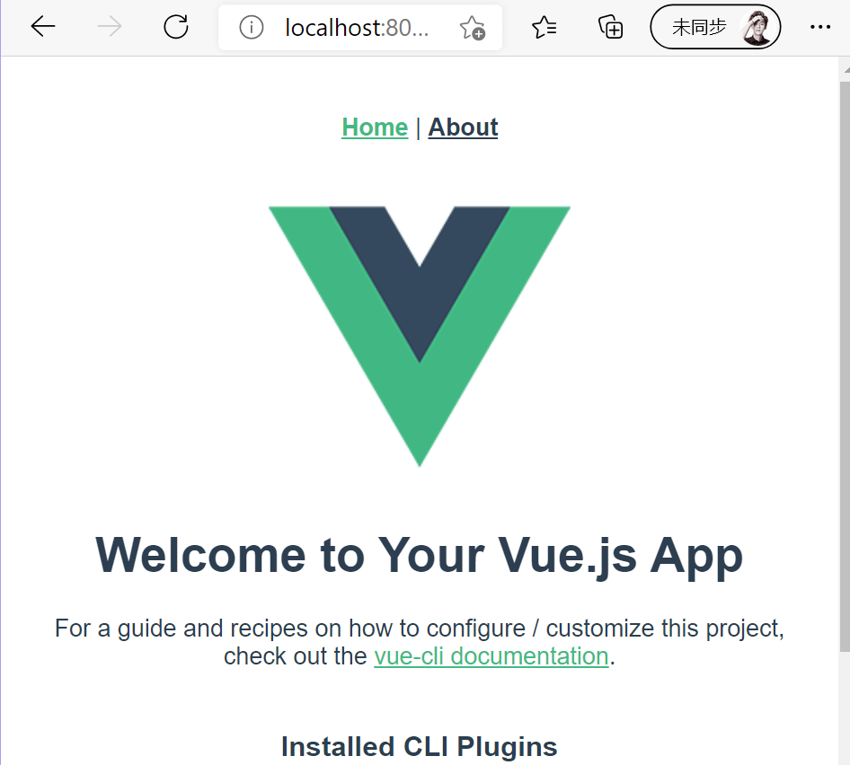


### 2.8 安装Element-ui并初始化

Element-ui官网文档有详细的安装使用过程：https://element.eleme.cn

本项目的安装步骤：

```cmd
# 1.进入工程目录
cd admin-vue
# 2.安装 element-ui
npm i element-ui -S  #或者cnpm install element-ui --save

# 2.安装 vue-router
npm install vue-router --save-dev
# 4.安装依赖
npm install
# 5.安装 SPSS 加载器
cnpm install sass-loader node-sass --save-dev
```

在src目录下的程序主入口`main.js`，引入element-ui依赖并显式使用：

```js
import Element from 'element-ui'
import "element-ui/lib/theme-chalk/index.css"
Vue.use(Element)
```


### 2.9 安装axios、qs、mockjs

#### 2.9.1 安装axios	

```
ajax技术实现了网页的局部数据刷新，axios实现了对ajax的封装。axios：提供了一些并发请求的接口（重要，方便了很多的操作）
所以：axios是用于网页异步刷新的
```

axios官网：http://www.axios-js.com/

官网最新cmd安装命令： 

```cmd
npm install axios
```

然后同样在main.js中全局引入axios:

```js
import axios from 'axios'
Vue.prototype.$axios = axios 
```

#### 2.9.2 安装qs

简单来说，qs 是一个增加了一些安全性的查询字符串解析和序列化字符串的库。

```cmd
npm install qs --save # cnpm install qs --save
```

#### 2.9.3 安装mockjs

mockjs官网：http://mockjs.com/

后台现在还没有搭建，无法与前端完成数据交互。因此引入mockjs方便后续提供api返回数据。

```cmd
npm install mockjs --save-dev # 或cnpm 
```

在src目录下新建mock.js文件，用于编写随机数据的api

在main.js中引入这个文件：

```js
require("./mock") //引入mock数据，关闭则注释该行
```


### 2.10 安装router

#### 步骤

vue路由：用于页面之间的交互连接

由于创建项目的时候我们已经安装了router，所以这里不用安装了。

如果没有安装router，则按照下面的步骤安装router！

1. 查看项目的`node_modules`目录中是否存在`vue-router`。如果不存在执行第2步

2. cmd进入项目中，执行以下命令：

   ```cmd
   npm install vue-router --save-dev
   ```

3. `router`目录下创建`index.js`等路由配置文件。

   ```js
   // 1.显式的导入vue和VueRouter包
   import Vue from 'vue'
   import VueRouter from 'vue-router'
   
   // 3. 导入要跳转的组件文件
   
   // 2. 必须显式声明安装使用路由功能
   Vue.use(VueRouter);
   
   // 4. 配置导出路由,这样别人才能通过路由,直接从前端进行组件跳转而不用在后端跳转
   export default new VueRouter({
     routes: [
       {
         path: '/content',   // 请求路径
         name: 'content',
         component: Content  // 跳转的组件
       },
       {
       }
     ]
   });
   ```

4. 在全局入口配置路由`main.js`

   ```js
   import router from './router'   // 1
   new Vue({
     router,   
   })
   ```

5. 通过路由在App.vue页面实现跳转

   ```vue
   <template>
     <div id="app">
       <div id="nav">
         <router-link to="/">Home</router-link> |
         <router-link to="/about">About</router-link>
       </div>
       <router-view/>
     </div>
   </template>
   ```


#### **路由小结：**

如何安装配置并使用路由功能？

- router的index.js：
  - 导入vue页面
  - 配置路由跳转
- 全局入口main.js配置路由：
  - 导入router包
  - vue对象中增加router
- 在某个vue页面中创建路由链接并显示
  - router-link
  - router-view


### 现在我们的vue项目基础结构构建好了！


## 3、前端页面开发

**页面显示流程：**

- 程序启动后，最底层显示的是vue自带的APP.vue;

- App.vue有三个子页面：home、login、about。当浏览器请求这三个页面时，会先显示APP.vue,再显示这三个页面；

- 而当请求index.vue时，由于其是home页面的子页面，所以会先显示app页面，然后显示home页面，最后渲染index页面，所以尽管index只有一行代码，但是仍能显示home的底层页面。

**也就是说：多级嵌套的路由会先显示底层的父级页面模板，再叠加渲染子级模板。下面实践说明！**


前端页面基本创建在views目录下面，下面依次创建这些页面！

### 3.1 默认显示的首页

==src/views/Index.vue==

这个页面暂时没什么用，之后修改

#### Ⅰ. 创建页面

```vue
<template>
  <h1>默认显示页面index.vue</h1>
</template>

<script>
export default {
  name: "Index"
}
</script>

<style scoped>

</style>
```

#### Ⅱ. 配置路由

```js
import Index from '../views/Index.vue'  // 1.默认显示页面
  {
    path: '/index',
    name: 'Index',
    component: Index
  },
```


### 3.2 登录首页

==src/views/Login.vue==

#### Ⅰ. 创建基础页面

使用带有参数校验的表单：在防止用户犯错的前提下，尽可能让用户更早地发现并纠正错误。

Form 组件提供了表单验证的功能，只需要通过 `rules` 属性传入约定的验证规则，并将 Form-Item 的 `prop` 属性设置为需校验的字段名即可。校验规则参见 [async-validator](https://github.com/yiminghe/async-validator)

```
Login.vue
</template>中是组件模板
<script>data()接收表单返回值：
- loginForm: 接收从前端绑定的表单数据
- rules：定义表单校验规则
```

```vue
<template>
  <!--template 只能有一个直系儿子-->
  <div id="bg">
    <div id="div-title">
      <h1 id="title-font"> Authority Management System </h1>
    </div>
    <div class="div-middle">
      <div class="div-bottom-middle"></div>
      <div class="div-bottom-middle">
        <div id="form-bg">
          <h2 id="login-font">Login</h2>
          <!--带有验证的表单:从文档复制来的,自己修改了部分内容-->
          <!--rules 属性传入约定的验证规则-->
          <!--prop 属性设置为需校验的字段名-->
          <!--设置表单: ref 绑定控件： ref="loginForm": 注册对象-->
          <!--:model是v-bind:model的缩写,用于绑定到return中的数据loginForm. v-model实现双向绑定数据:前端输入,vue字段接收;反之也成立-->
          <el-form :model="loginForm" :rules="rules"
                   ref="loginForm" label-width="25%"
                   class="demo-loginForm" label-position="left"
                   size="mini">
            <el-form-item label="账  号" class="label-font"  prop="username" >
              <el-input v-model="loginForm.username" placeholder="Username" class="inputtext"></el-input>
            </el-form-item>
            <el-form-item label="密  码"  class="label-font" prop="password">
              <el-input  v-model="loginForm.password" placeholder="Password" class="inputtext"></el-input>
            </el-form-item>
            <el-form-item label="验证码" class="label-font-code" prop="code" >
              <el-input v-model="loginForm.code" placeholder="Check Code" class="inputcode inputtext"></el-input>
              <!--这个元素用于防止校验码图像,src是图像路径-->
              <el-image src="" class="codeimg"></el-image>
            </el-form-item>
            <!--<el-form-item>-->
            <!--  -->
            <!--</el-form-item>-->
            <!--点击处罚按钮事件-->
            <el-button type="primary" @click="submitForm('loginForm')">登录</el-button>
            <el-button @click="resetForm('loginForm')">重置</el-button>

          </el-form>

        </div>
      </div>
      <div class="div-bottom-middle"></div>
    </div>
    <div id="div-bottom">
      <!--可以在这里写联系方式-->
    </div>
  </div>
</template>

<script>
export default {
  name: "Login",
  data() {
    return {
      loginForm: {
        username: '',
        password: '',
        code: '',
        // token用于获取验证码生成的随机码
        token: ''
      },
      // 表单校验规则
      rules: {
        username: [
          //  trigger:blur 当失去焦点的时候,触发规则验证
          // required: true 表示这个是必填选项
          { required: true, message: '请输入用户名', trigger: 'blur' },
        ],
        password: [
          { required: true, message: '请输入密码', trigger: 'blur' },
        ],
        code: [
          { required: true, message: '请输入验证码', trigger: 'blur' },
          { min: 5, max: 5, message: '长度为 5 个字符', trigger: 'blur' }
        ]
      }
    };
  },
  methods: {
    submitForm(formName) {
      this.$refs[formName].validate((valid) => {
        if (valid) {
          alert('submit!');
        } else {
          console.log('error submit!!');
          return false;
        }
      });
    },
    // 重置信息
    resetForm(formName) {
      this.$refs[formName].resetFields();
    }
  }
}
</script>

<style scoped>
/*设置登录页的背景图像*/
#bg{
  background:url("../assets/bg1.jpg");
  /*大小设置为100%*/
  width:100%;
  height:100%;
  position: fixed;
  background-size:100% 100%;
  margin: -10px -10px -10px -10px;
  /*display: flex;*/
  /*align-items: center;*/
}
#div-title {
  width:100%;
  height:20%;
}
#title-font{
  color: white;
  text-align:center;
  padding: 3% 2% 9% 2%;
  /*自适应调整字体大小*/
  font-size: 4vw;
}
.div-middle{
  width:100%;
  height:55%;
  display: flex; /*将子元素设置成一行: 并等分*/
}
.div-bottom{
  width:100%;
  height:20%;
}
.div-bottom-middle{
  flex: 1; /*将子元素设置成一行: 并等分*/
}
#form-bg {
  height: 100%;
  width: 100%;
  /*使用rgba设置半透明的背景色*/
  background: rgba(248,248,255,0.5);
  border-radius: 6px;
  box-shadow: 0 2px 12px 0 rgba(0, 0, 0, 0.1)
}
#login-font{
  font-size: 2vw;
  padding: 6% 2% 6% 2%;
  opacity:1
}
.el-form {
  padding: 0 2% 6% 5%;
}
.label-font{
  font-size: 1vw;
  padding: -10px 0 0 0;
}
.label-font-code{
  font-size: 1vw;
}
.inputtext{
  float: left;
  width: 80%;
  height: 100%;
  flex: 1; /*将子元素设置成一行: 并等分*/
}
.inputcode{
  width: 55%;
  height: 100%;
  flex: 1;
}
.codeimg{
  float: left;
  margin-left: 8px;
  border-radius: 4px;
}

</style>
```


#### Ⅱ. 验证码获取

##### **验证码获取的流程**

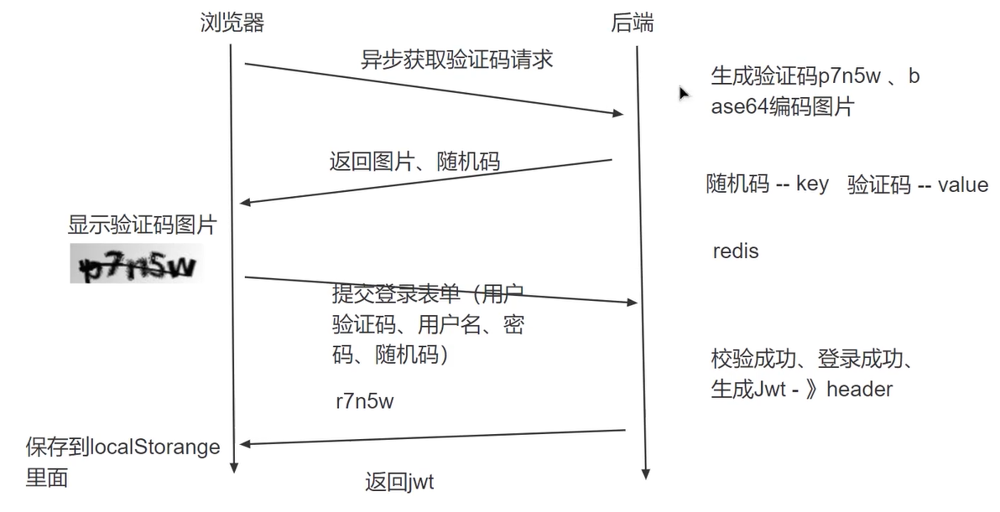

根据上图交互流程，请求生成验证码并验证真确性的过程需要参数（用户名、密码、验证码和随机码），因此在`loginForm`中增加字段token用来传递随机码。

由于生成验证码的过程需要和后端通信，而此时只有前端，因此我们使用mockjs来模拟后端生成随机数据，如下操作!


##### 使用mockjs模拟后端提供验证码图像和随机码

1. 在main.js中声明使用mockjs:`require("./mock.js")`

2. 与main.js同级新建一个`mock.js`，在其中模拟验证码请求'/captcha' 后的返回数据：

```js
// 引入mockjs,创建mockjs对象
const Mock = require('mockjs');
// 获取 mock.Random 对象
const Random = Mock.Random;
// 模拟数据的封装
let Result = {
    code: 200,
    msg: '操作成功',
    data: null
};
//模拟'/captcha'请求的返回结果:即模拟点击验证码图像后的响应结果
Mock.mock('/captcha', "get", () =>  {
    // 点击验证码图像响应后的返回结果:
    // 验证码的响应需要两个结果:token随机码和验证码图像
    Result.data = {
        // 生成的token随机码是一个32为数据
        token: Random.string(32),
        captchaImg: Random.dataImage('100x50', 'pn454')  // 注意这里的x是英文字母x,不然会报错
    }
    return Result
})
```

3. 在`Login.vue`前端页面中增加验证码请求的方法处理方法：

```vue
<script>
export default {
  ......
  methods: {
    getCaptcha(){  // 【捕获验证码图片的方法】
      // 点击验证码图片位置向后端发起异步请求,刷新创建新的验证码图片
      this.$axios.get('/captcha', this.loginForm).then(res =>{
        // 获取验证码对应的随机码：其中res.data表示结果, 第二个data表示结果中的属性data
        this.loginForm.token = res.data.data.token;  
        this.captchaImg = res.data.data.captchaImg  // 获取验证码图像
      })
    }
  } // methods
  created() {  // 一般可以在created函数中调用ajax获取页面初始化所需的数据。
    this.getCaptcha();   // 调用登录页验证码请求,来显示初始验证码
  }
}
</script>
```

4. 此时刷新界面就可以显示验证码了：

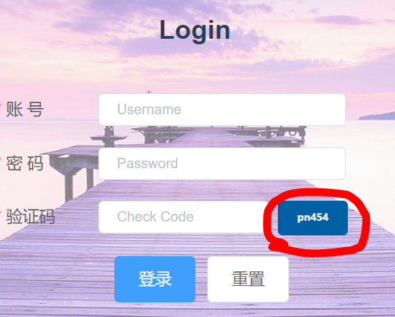


#### Ⅲ. 表单提交

##### 存储 jwt

如果表单信息校验成功、登录成功，应该要生成一个JWT并保存在header中，之后将JWT随header返回给前端。前端则会将JWT保存到 localStorage 中。以后每次访问时，就会携带jwt告诉后端，请求是谁发起的。


而 localStorage  存在于 `store`目录下的 `index.js` 文件中。这个目录下的文件中专门用来存储这种网络通信中的数据。因此下面先在`store->index.js`中存储后端传来的jwt。


在下面的程序中：state方法中的属性不能直接操作，因此可以在mutations方法中自定义方法来完成对state中属性的访问。

```js
import Vue from 'vue'
import Vuex from 'vuex'
Vue.use(Vuex)
export default new Vuex.Store({
  state: {  // state中的变量不能直接操作,需要在mutations中解析
    token: ''
  },
  mutations: {
    // 为了操作state属性中的变量token,自定义一个SET_TOKEN方法
    SET_TOKEN: (state, token) => {  // 将后端传来的token注入state属性进行存储
      state.token = token
      localStorage.setItem("token", token)
    }
  },
  actions: {
  },
  modules: {
  }
})
```


##### 登录按钮事件响应

下面在Login.vue中，点击”登录“按钮触发的方法`submitForm()`中：

- 判断用户登录信息是否正确
- 异步刷新并路由跳转到登陆后的界面：
  - 获取jwt
  - 存储jwt
  - 路由跳转新页面

```vue
<script>
export default {
  ....其他属性代码省略....
    
  methods: {
    submitForm(formName) {
      this.$refs[formName].validate((valid) => {
        if (valid) { // 如果校验成功可以登录
          // 设置登录成功后的效果:从this.loginForm获取前端的结果
          // ajax技术实现了网页的局部数据刷新，axios实现了对ajax的封装。
          // axios：提供了一些并发请求的接口（重要，方便了很多的操作）
          this.$axios.post('/login', this.loginForm).then(res =>{
            // 登录校验成功后,服务器会将JWT封装在header中并返回给客户端,
            // 客户端应该将jwt信息保存.之后每一次访问都将jwt发给后端用来快速验证
            const jwt = res.headers['authorization']  // 1.获取jwt
            // 2.浏览器存储jwt
            this.$store.commit("SET_TOKEN", jwt)

            // 完成以上工作后就可以进行界面跳转了,使用router进行跳转
            this.$router.push("/index")
          })
        } else {
          console.log('error submit!!');
          return false;
        }
      });
    }
    ....其他方法代码省略....
  }
}
```


##### 使用mock模拟用户信息完成登陆验证

在`mock.js`中模拟后端验证返回的结果：具体的验证对比不用写，这里只是位置测试

```js
// 引入mockjs,创建mockjs对象
const Mock = require('mockjs');
// 获取 mock.Random 对象
const Random = Mock.Random;
// 模拟数据的封装
let Result = {
    code: 200,
    msg: '操作成功',
    data: null
};
//模拟'/login'请求的返回结果:即模拟用户登录信息响应
Mock.mock('/login', "post", () =>  {
    // 无法在header中传入jwt
    return Result
})
```


##### 测试

登陆页面点击”登录“按钮后跳转到了index页面

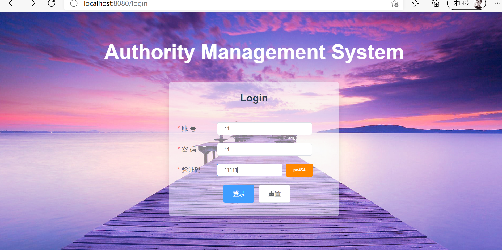


#### Ⅳ. axios拦截

参考： https://www.jianshu.com/p/646ed4edf51f

1. 创建 admin-vue/src/axios.js。并在其中编写对request请求和response响应的拦截代码

```js
import axios from "axios";
import router from "./router";
import Element from "element-ui";
import {createConfig} from "http-proxy-middleware/dist/config-factory";
import {responseInterceptor} from "http-proxy-middleware";

// 定义axios的全局URL,不能与项目的url一样8080, 所以这里设置成8081端口
axios.defaults.baseURL = "http://localhost:8081"
// 定义一个对象, 可以统一设置超时时间等属性
const request = axios.create({
    timeout: 5000,
    headers: {
        'Content-Type': "application/json; charset=utf-8"
    }
})
// 下面进行拦截
// 首先拦截request请求
request.interceptors.request.use(config=>{
    config.headers['Authorization'] = localStorage.getItem("token")
    return config
})
// 然后拦截response响应
request.interceptors.response.use(response=>{
    let res = response.data // 获取response的数据西信息
    if (res.code === 200){ // 如果响应码是200,说明返回信息没有问题
        return response // 直接继续传递response
    }else{  // 如果响应码有问题,则拦截并报警
        Element.Message.error(!res.msg? '系统异常': res.msg)
        return Promise.reject(response.data.msg)  // 拒绝信息
    }
}, error =>{  // 如果过程中出现了一些异常,可以进一步判断 状态码是不是401等
    if (error.response.data){
        error.message = error.response.data.msg
    }
    if (error.response.status === 401){
        router.push("/login")
    }
    Element.Message.error(error.message,  {duration: 3000})
    return Promise.reject(error)
})
// 最后将request进行export
export default request
```

2. 在 main.js 中引用自定义的 axios ，代替默认的 axios

```js
// 手动2: 引入axios
// import axios from 'axios'
import axios from "./axios"  // 用自定义的axios代替默认的axios 
```

3. 测试：
   - 当验证码不是200，而是400。会报"系统异常"

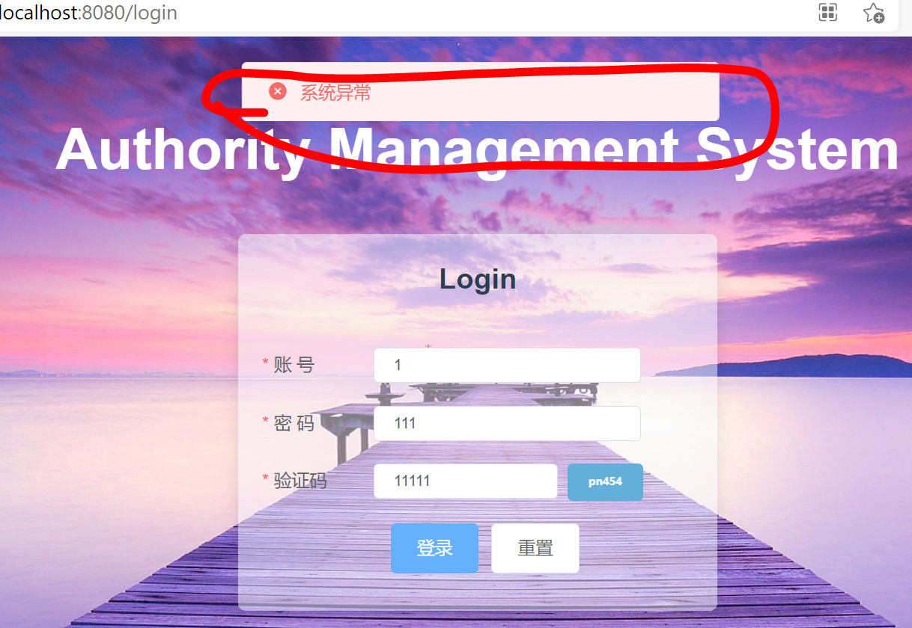


#### 遇到的问题

node-sass和sass-loader版本不匹配：

node-sass5.0.0和sass-loader 10.1.1可以匹配

mockjs中：`Random.dataImage('100x50', 'pn454') 这里的x是英文字母x`


### 3.3 后台管理页面-首页

==src/views/index.vue==

#### Ⅰ. 创建基础页面 + 配置路由

1、在路由文件中给`index.vue页面`添加路由

```js
import Index from '../views/Index.vue'  // 1.显示后台默认页面
  {
    path: '/index',
    name: 'Index',
    component: Index
  },
```

2、index.vue页面 中创建布局（Container 布局容器）

```html
  <el-container id="all">
    <el-aside width="200px">Aside</el-aside>
    <el-container id="all1">
      <el-header>Header</el-header>
      <el-main>Main</el-main>
    </el-container>
  </el-container>
```

3、设计头部

```html
<!--1.设计头部-->
<el-header>
  <strong>后台管理界面</strong>
  <div class="headimg">
    <!--头像框-->
    <el-avatar class="userimg" size="medium">User</el-avatar>

    <!--下拉菜单-->
    <el-dropdown class="dropdown">
      <span class="el-dropdown-link">
        用户空间<i class="el-icon-arrow-down el-icon--right"></i>
      </span>
      <el-dropdown-menu slot="dropdown">
        <el-dropdown-item>个人中心</el-dropdown-item>
        <el-dropdown-item>退出</el-dropdown-item>
      </el-dropdown-menu>
    </el-dropdown>

    <!--页面内的网页跳转-->
    <el-link class="el-link-1" href="https://www.baidu.com/" target="_blank">网站</el-link>
    <el-link href="https://www.bilibili.com/video/BV1af4y1s7Wh?p=10&spm_id_from=pageDriver" target="_blank">视频</el-link>
  </div>
</el-header>
```

4、设计左侧导航栏

```html
<el-aside width="200px">
  <el-menu
      default-active="2"
      class="menu_total el-menu-vertical-demo"
      background-color="#545c64"
      text-color="#fff"
      active-text-color="#ffd04b">
      <!--@open="handleOpen"-->
      <!--@close="handleClose"-->

    <!--导航栏标题-->
    <el-menu-item>
      <template slot="title">
        <i class="el-icon-s-home"></i>
        <span><strong  class="toolbar-title">主页</strong></span>
      </template>
    </el-menu-item>


    <!--导航栏选项-->
    <el-submenu index="1">
      <template slot="title">
        <i class="el-icon-location"></i>
        <span>系统管理</span>
      </template>

      <el-menu-item index="1-1">
        <template slot="title">
          <i class="el-icon-user"></i>
          <span>用户管理</span>
        </template>
      </el-menu-item>
      <el-menu-item index="1-2">
        <template slot="title">
          <i class="el-icon-view"></i>
          <span>角色管理</span>
        </template>
      </el-menu-item>
      <el-menu-item index="1-3">
        <template slot="title">
          <i class="el-icon-menu"></i>
          <span>菜单管理</span>
        </template>
      </el-menu-item>
    </el-submenu>

    <el-submenu index="2">
      <template slot="title">
        <i class="el-icon-s-tools"></i>
        <span>系统工具</span>
      </template>
      <el-menu-item index="2-1">
        <template slot="title">
          <i class="el-icon-tickets"></i>
          <span>数字字典</span>
        </template>
      </el-menu-item>
    </el-submenu>
  </el-menu>
</el-aside>
```

5、综上，整个基础页面

```vue
<template>
  <el-container id="all">
    <!--2.设计左侧导航栏-->
    <!--===================================2.设计左侧导航栏=========================================-->
    <el-aside width="200px">
      <el-menu
          default-active="2"
          class="menu_total el-menu-vertical-demo"
          background-color="#545c64"
          text-color="#fff"
          active-text-color="#ffd04b">
          <!--@open="handleOpen"-->
          <!--@close="handleClose"-->

        <!--导航栏标题-->
        <el-menu-item>
          <template slot="title">
            <i class="el-icon-s-home"></i>
            <span><strong  class="toolbar-title">主页</strong></span>
          </template>
        </el-menu-item>


        <!--导航栏选项-->
        <el-submenu index="1">
          <template slot="title">
            <i class="el-icon-location"></i>
            <span>系统管理</span>
          </template>

          <el-menu-item index="1-1">
            <template slot="title">
              <i class="el-icon-user"></i>
              <span>用户管理</span>
            </template>
          </el-menu-item>
          <el-menu-item index="1-2">
            <template slot="title">
              <i class="el-icon-view"></i>
              <span>角色管理</span>
            </template>
          </el-menu-item>
          <el-menu-item index="1-3">
            <template slot="title">
              <i class="el-icon-menu"></i>
              <span>菜单管理</span>
            </template>
          </el-menu-item>
        </el-submenu>

        <el-submenu index="2">
          <template slot="title">
            <i class="el-icon-s-tools"></i>
            <span>系统工具</span>
          </template>
          <el-menu-item index="2-1">
            <template slot="title">
              <i class="el-icon-tickets"></i>
              <span>数字字典</span>
            </template>
          </el-menu-item>
        </el-submenu>
      </el-menu>
    </el-aside>

    <el-container id="all1">
      <!--===================================1.设计头部=========================================-->
      <el-header id="header">
        <strong>后台管理界面</strong>
        <div class="headimg">
          <!--头像框-->
          <el-avatar class="userimg" size="medium">User</el-avatar>

          <!--下拉菜单-->
          <el-dropdown class="dropdown">
            <span class="el-dropdown-link">
              用户空间<i class="el-icon-arrow-down el-icon--right"></i>
            </span>
            <el-dropdown-menu slot="dropdown">
              <el-dropdown-item>个人中心</el-dropdown-item>
              <el-dropdown-item>退出</el-dropdown-item>
            </el-dropdown-menu>
          </el-dropdown>

          <!--页面内的网页跳转-->
          <el-link class="el-link-1" href="https://www.baidu.com/" target="_blank">网站</el-link>
          <el-link href="https://www.bilibili.com/video/BV1af4y1s7Wh?p=10&spm_id_from=pageDriver" target="_blank">视频</el-link>
        </div>
      </el-header>
      <!--===================================3.设计主界面=========================================-->
      <el-main>


      </el-main>
    </el-container>
  </el-container>
</template>

<script>
export default {
  name: "Index",
  methods: {
    handleOpen(key, keyPath) {
      console.log(key, keyPath);
    },
    handleClose(key, keyPath) {
      console.log(key, keyPath);
    }
  }
}
</script>


<style scoped>
/*设置最大的容器*/
#all{
  padding: 0;
  margin: -10px -10px -10px -10px;
  height: 100%;
  width: 100%;
  position: fixed;
}
/*设置其中右侧的容器样式*/
#all1{
  padding: 0;
  margin: 0;
  height: 100%;
}

/*设置左侧菜单栏*/
.el-aside {
  background-color: darkslategray;
  color: #333;
  /*text-align: center;*/
  line-height: 200px;
}
/*设置右侧头部框*/
.el-header, .el-footer {
  background-color: palegoldenrod;
  color: #333;
  text-align: center;
  line-height: 60px;
  height: 20%;
}
/*设置右下主界面*/
.el-main {
  background-color: lightgoldenrodyellow;
  color: #333;
  text-align: center;
  line-height: 160px;
  height: 80%;
}
/*设置头像框div*/
.headimg{
  width: 250px;
  /*向右侧浮动,保持行内水平*/
  float: right;
  /*设置上下居中*/
  display: flex;
  align-items: center;
}
/*设置头像*/
.userimg{
  /*设置右侧外部间隔*/
  margin-right: 8px;
  /*设置背景图像*/
  background-image: url("../assets/touxiang.png");
  /*设置背景图像的大小*/
  background-size: cover;
}
/*下拉框*/
.dropdown{
  margin-right: 8px;
}
.el-link-1{
  margin-right: 8px;
}
/*设置下拉菜单属性*/
.el-dropdown-link {
  cursor: pointer;
  color: #6A5ACD;
  /*color: #409EFF;*/
}
.el-icon-arrow-down {
  font-size: 12px;
}

.menu_total{
  height: 100%;
  width: 200px;
  position: fixed;
  background-color: darkslategray;
  /*color: #333;*/
  text-align: left;
  line-height: 200px;
  float: left;
}
.toolbar-title{
  color: #FFA500;
}

</style>
```


#### Ⅱ. 抽取并建立公共页面

由于侧边栏和头部几乎在每一个界面都会出现，因此将这些部分抽取出来并放到单另的公共界面中，以便其他页面使用。


在`views`这个目录中新建子目录`inc`用来存放公共界面。在`inc`目录下创建如下几个子公共界面：


1、`SideMenu.vue`编写侧边栏样式

```vue
<template>
  <el-menu
      default-active="2"
      class="menu_total el-menu-vertical-demo"
      background-color="#545c64"
      text-color="#fff"
      active-text-color="#ffd04b">
    <!--@open="handleOpen"-->
    <!--@close="handleClose"-->

    <!--导航栏标题-->
    <el-menu-item>
      <template slot="title">
        <i class="el-icon-s-home"></i>
        <span><strong  class="toolbar-title">主页</strong></span>
      </template>
    </el-menu-item>


    <!--导航栏选项-->
    <el-submenu index="1">
      <template slot="title">
        <i class="el-icon-location"></i>
        <span>系统管理</span>
      </template>

      <el-menu-item index="1-1">
        <template slot="title">
          <i class="el-icon-user"></i>
          <span>用户管理</span>
        </template>
      </el-menu-item>
      <el-menu-item index="1-2">
        <template slot="title">
          <i class="el-icon-view"></i>
          <span>角色管理</span>
        </template>
      </el-menu-item>
      <el-menu-item index="1-3">
        <template slot="title">
          <i class="el-icon-menu"></i>
          <span>菜单管理</span>
        </template>
      </el-menu-item>
    </el-submenu>

    <el-submenu index="2">
      <template slot="title">
        <i class="el-icon-s-tools"></i>
        <span>系统工具</span>
      </template>
      <el-menu-item index="2-1">
        <template slot="title">
          <i class="el-icon-tickets"></i>
          <span>数字字典</span>
        </template>
      </el-menu-item>
    </el-submenu>
  </el-menu>
</template>

<script>
export default {
  name: "SideMenu"
}
</script>

<style scoped>
.menu_total{
  height: 100%;
  width: 200px;
  position: fixed;
  background-color: darkslategray;
  /*color: #333;*/
  text-align: left;
  line-height: 200px;
  float: left;
}
.toolbar-title{
  color: #FFA500;
}

</style>
```

2、`Header.vue` 提取头部

```vue
<template>
  <div>
  <strong>后台管理界面</strong>
  <div class="headimg">
    <!--头像框-->
    <el-avatar class="userimg" size="medium">User</el-avatar>

    <!--下拉菜单-->
    <el-dropdown class="dropdown">
            <span class="el-dropdown-link">
              用户空间<i class="el-icon-arrow-down el-icon--right"></i>
            </span>
      <el-dropdown-menu slot="dropdown">
        <el-dropdown-item>个人中心</el-dropdown-item>
        <el-dropdown-item>退出</el-dropdown-item>
      </el-dropdown-menu>
    </el-dropdown>

    <!--页面内的网页跳转-->
    <el-link class="el-link-1" href="https://www.baidu.com/" target="_blank">网站</el-link>
    <el-link href="https://www.bilibili.com/video/BV1af4y1s7Wh?p=10&spm_id_from=pageDriver" target="_blank">视频</el-link>
  </div>
  </div>
</template>

<script>
export default {
  name: "Header"
}
</script>

<style scoped>

/*设置头像框div*/
.headimg{
  width: 250px;
  /*向右侧浮动,保持行内水平*/
  float: right;
  /*设置上下居中*/
  display: flex;
  align-items: center;
}
/*设置头像*/
.userimg{
  /*设置右侧外部间隔*/
  margin-right: 8px;
  /*设置背景图像*/
  background-image: url("../../assets/touxiang.png");
  /*设置背景图像的大小*/
  background-size: cover;
}
/*下拉框*/
.dropdown{
  margin-right: 8px;
}
.el-link-1{
  margin-right: 8px;
}
/*设置下拉菜单属性*/
.el-dropdown-link {
  cursor: pointer;
  color: #6A5ACD;
  /*color: #409EFF;*/
}
.el-icon-arrow-down {
  font-size: 12px;
}
</style>
```


然后在`index.vue` 中引用这两个公共界面：

```vue
<template>
  <el-container id="all">
    <el-aside width="200px">
      <!--【 3. 使用已经引用的侧边栏的包 SideMenu 】-->
      <SideMenu></SideMenu>
    </el-aside>

    <el-container id="all1">
      <el-header id="header">
       <!--【 3. 使用已经引用的头部的包 Header】-->
        <Header></Header>
      </el-header>
      <el-main>
          主体
      </el-main>
    </el-container>
  </el-container>
</template>

<script>
// 【 1.引入SideMenu 侧边栏的包文件 】
import SideMenu from "@/views/inc/SideMenu";
import Header from "@/views/inc/Header";
export default {
  name: "Index",
  // 【 2. 在components声明嵌入的组件 】
  components: {
    SideMenu,
    Header
  }
}
</script>

<style scoped>
#all{
  padding: 0;
  margin: -10px -10px -10px -10px;
  height: 100%;
  width:100%;
  position: fixed;
}
#all1{
  padding: 0;
  margin: 0;
  height: 100%;
}
</style>
```


#### Ⅲ. 将页面转移到home页面

我们先理解一下页面逻辑：

App.vue中有:

```vue
<template>
  <div id="app">  【app是源码中的】
    <router-view/> 【这个router-view/会使程序自动进入路由文件中index.js，查找对应的请求】
  </div>
</template>
```

现在index.js 路由文件中设置三个一级请求（此时只用增加/home）：

```vue
const routes = [
  {
    path: '/home',
    children:[
      {
        path: '/index',
      }
    ]
  },
  {
    path: '/about',
  },
  {
    path: '/login',
  }
]
```

浏览器请求上面三个中任意一个请求会进入对应的页面。

然后，在/home中嵌入一个子请求`/index`。

将index中所有的代码移入home.vue中，使得index.vue中只显示主体部分：

```vue
<template>         【index.vue】
  <div>main</div>
</template>
<script>
export default {
  name: "Index"
}
</script>
```

home文件中显示其余节点，作为默认的父级节点。同时在home.vue中需要嵌入index.vue的地方使用<router-view>表示，路由文件中已经在/home中加入了children:[/index]作为这个页面中的一个子页面：

```vue
<template>
  <el-container id="all">
    <el-aside width="200px">
      <!--3. 使用已经引用的侧边栏的包-->
      <SideMenu></SideMenu>
    </el-aside>

    <el-container id="all1">
      <el-header id="header">
        <!-- 嵌入头部-->
        <Header></Header>
      </el-header>
      <el-main id="el-main">
        <!--当浏览器请求/index会异步显示这部分局部页面-->
        <router-view></router-view>                【这里嵌入子路由】
      </el-main>
    </el-container>
  </el-container>
</template>

<script>
// 1.引入SideMenu 侧边栏的包文件
import SideMenu from "@/views/inc/SideMenu";
import Header from "@/views/inc/Header";
export default {
  name: "Home",
  components: {
    Header,
    SideMenu,
  }
}
</script>

<!--css 样式表 =====================================-->
<style scoped>
</style>
```

**页面显示流程：**

- 程序启动后，最底层显示的是vue自带的APP.vue;

- App.vue有三个子页面：home、login、about。当浏览器请求这三个页面时，会先显示APP.vue,再显示这三个页面；

- 而当请求index.vue时，由于其是home页面的子页面，所以会先显示app页面，然后显示home页面，最后渲染index页面，所以尽管index只有一行代码，但是仍能显示home的底层页面。

**也就是说：多级嵌套的路由会先显示底层的父级页面模板，再叠加渲染子级模板**


### 3.4 添加主页中的子页面

==src/views/Login.vue==

#### Ⅰ. 创建页面文件

- views目录下创建sys目录

- 在这个目录下创建三个页面：`User.vue`  `Menu.vue`  `Role.vue`

#### Ⅱ. 配置几个页面的路由 

这三个文件都会作为home页面的子路由，因此在home页面的子路由下面配置这三个页面的路由：

```js
// 导入home页面的sys目录下的子路由
import Menu from "@/views/sys/Menu";
import Role from "@/views/sys/Role";
import User from "@/views/sys/User";

  {
    path: '/home',
    name: 'Home',
    component: Home,
    children:[   // 创建home页面的子路由
      {
        path: '/users',
        name: 'SysUser',
        component: User
      },
      {
        path: '/roles',
        name: 'SysRole',
        component: Role
      },
      {
        path: '/menus',
        name: 'SysMenu',
        component: Menu
      }
    ]
  }
```

浏览器输入任意一个请求验证显示结果，在页面主体部分会显示文字：

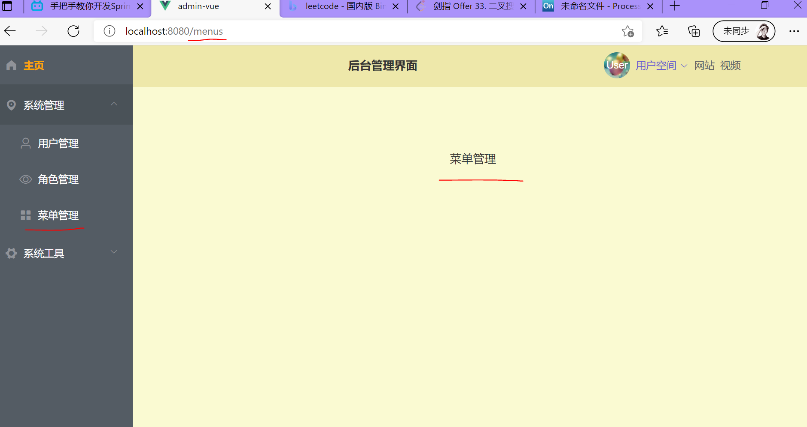


#### Ⅲ. 页面切换

经过上面的两步，直接在浏览器输入'/users' ,  '/roles',  '/menus' 这三个链接，在主页面中会显示简单的内容。但是直接点击左侧导航栏中的三个按钮不会进行切换，因为我们还没有将这三个按钮的路由添加到页面中。下面进行配置。


这三个按钮出现在`SideMenu.vue`导航页面中。因此在出现这三个页面的标签前后包裹`<router-link to=""></router-link>`

```vue
<template>
  <el-menu
      default-active="2"
      class="menu_total el-menu-vertical-demo"
      background-color="#545c64"
      text-color="#fff"
      active-text-color="#ffd04b">
    <!--@open="handleOpen"-->
    <!--@close="handleClose"-->

    <!--导航栏标题-->
    <router-link to="/index">             【包裹router-link】
      <el-menu-item>
        <template slot="title">
          <i class="el-icon-s-home"></i>
          <span><strong class="toolbar-title">主页</strong></span>
        </template>
      </el-menu-item>
    </router-link>                        【包裹router-link】

    <!--导航栏选项-->
    <el-submenu index="1">
      <template slot="title">
        <i class="el-icon-location"></i>
        <span>系统管理</span>
      </template>

      <router-link to="/users">            【包裹router-link】
        <el-menu-item index="1-1">
          <template slot="title">
            <i class="el-icon-user"></i>
            <span>用户管理</span>           
          </template>
        </el-menu-item>
      </router-link>                       【包裹router-link】
        
      <router-link to="/roles">            【包裹router-link】 
        <el-menu-item index="1-2">
          <template slot="title">
            <i class="el-icon-view"></i>
            <span>角色管理</span>
          </template>
        </el-menu-item>
      </router-link>                       【包裹router-link】
        
      <router-link to="/menus">            【包裹router-link】
        <el-menu-item index="1-3">
          <template slot="title">
            <i class="el-icon-menu"></i>
            <span>菜单管理</span>
          </template>
        </el-menu-item>
      </router-link>                       【包裹router-link】
    </el-submenu>

    <el-submenu index="2">
      <template slot="title">
        <i class="el-icon-s-tools"></i>
        <span>系统工具</span>
      </template>
      <el-menu-item index="2-1">
        <template slot="title">
          <i class="el-icon-tickets"></i>
          <span>数字字典</span>
        </template>
      </el-menu-item>
    </el-submenu>


  </el-menu>
</template>

```

现在点击左侧导航栏中的三个按钮就会有 Ⅱ 中的显示效果，说明页面内的路由链接成功


### 3.5 用户信息展示

#### 3.5.1 头像和用户名

点击右上角用户头像相关的链接应该显示用户的详细信息。

`Header.vue`中修改相关代码

```
相关知识点补充：
vue中在methods属性的作用：
	1.使用methods属性给vue定义方法
	2.在方法中使用this.属性名就可以直接访问data中的数据
	3.在构造函数外部可以使用vm.方法名定义或者调用方法
	
vue中data()方法的作用：
	1.起到局部变量的作用。 return的变量和方法只限于当前声明此data（）的组件使用
	2.指定设置当前vue实例所使用的数据，data的值可以是一个对象
	3.响应式数据（当数据发生变化的时候，视图中的数据会自动发生变化）
```

下面首先修改`Header.vue` 中的代码将头像显示和用户名显示进行更改

```vue
<template>
  <el-header id="header">
      .......
    <div class="headimg">
      <!--头像框--> <!--:src 传入用户头像-->
      <el-avatar :src="userInfo.avatar"  【userInfo.avatar传入mockjs头像图片】
                 class="userimg" size="medium" >User
      </el-avatar>
      <!--下拉菜单-->
      <el-dropdown class="dropdown">
            <span class="el-dropdown-link">
              <!--传入用户名-->
              {{userInfo.username}}    【{{userInfo.username}}传入用户名字符串】
              <i class="el-icon-arrow-down el-icon--right"></i>
            </span>
      </el-dropdown>
    </div>
  </el-header>
</template>

<script>
export default {
  name: "Header",
  data(){                    
  // 向这个页面(头部)返回用户信息  
  return {                         【data属性中return 返回参数并供本页面节点使用】
      userInfo: {
        id: "",
        username: "",
        avatar: ""
      }
    }
  },
  // 在methods中定义用户方法
  methods: {                     【methods属性中自定义方法】
    getUserInfo(){               【getUserInfo()属性中】
      this.$axios.get("/sys/userInfo").then(res=>{
        this.userInfo = res.data.data
      })
    }
  },
  created() { // 接收调用用户方法
    this.getUserInfo()  // 页面加载的时候获取用户信息
  }
}
</script>

```

然后再mockjs中模拟用户信息

```js
//模拟'/sys/userInfo' 请求  获取用户信息
Mock.mock('/sys/userInfo', "get", () =>  {
    Result.data = {
        // 根据Header.vue中data() return的结果,返回对应的用户信息
        id: "1",
        username: "nini",
        avatar: "https://img.zcool.cn/community/01129957723f4b0000018c1b6692bb.jpg@1280w_1l_2o_100sh.jpg"
    }
    return Result
})
```


#### 下拉菜单--个人中心

