# “AMS” 前端开发手册


## 1. 简介

AMS是一个博客后台权限管理系统。

可管理三种用户：

- 主人：拥有所有权限（增删改查）
- 游客：只有查看权限
- 登录用户：用于查看权限和部分编辑功能

技术栈：

- Vue

开发环境：

- windows10


下面开始开发啦！


## 2. 创建新项目，搭建基础环境

需要安装的东西：

- Node.js：是一个基于Chrome V8引擎的[JavaScript](https://baike.baidu.com/item/JavaScript/321142)运行环境
- NPM：是随同NodeJS一起安装的包管理工具，能解决NodeJS代码部署上的很多问题
- Node.js 淘宝镜像加速器（cnpm）：简单理解为npm的备用版本
- vue-cli：这里安装3以上的版本，可以使用vue-ui可视化窗口
- IDEA安装vue插件
- Element-ui：UI组件库，类似BootStrap
- axios：一个基于 promise 的 HTTP 库，类ajax。进行前后端对接的时候，使用这个工具可以提高我们的开发效率
- qs：查询参数序列化和解析库
- mockjs：为我们生成随机数据的工具库
- vue-router：vue路由，用于页面之间的交互连接

------

### 2.1 安装Node.js及NPM

由于新版的nodejs已经集成了npm，所以安装NodeJS的同时NPN也一并安装好了。

1. 官网`http://nodejs.cn/download`下载64位安装包，无脑安装即可。

2. cmd下输入 `node -v`，查看是否能够正确打印版本号即可，如下图

3. cmd下输入 `npm -v`，查看是否能够正常打印版本号即可，如下图


### 2.2 淘宝镜像加速器 cnpm

npm安装插件过程：从[http://registry.npmjs.org](http://registry.npmjs.org/)下载对应的插件包（该网站服务器位于国外，所以经常下载缓慢或出现异常），解决办法就是用cnpm代替。

所以cnpm可以理解为npm的加速版本，出现下载不了的情况时，可以用cnpm代替。

在cmd中输入下面的命令安装（推荐使用第一条命令）：

```cmd
# 推荐：-g 就是全局安装
npm install cnpm -g
# 不推荐：使用如下语句解决npm速度慢的问题(每次安装的时候都带上)
npm install --registry=https://registry.npm.taobao.org
```

安装成功结果如下。划线路径是cnpm的默认安装位置（安装在隐藏目录中）


### 2.3 SPSS 加载器

```cmd
# 安装 SPSS 加载器
cnpm install sass-loader node-sass --save-dev
```


### 2.4 安装 vue-cli

Vue CLI官网有安装教程：https://cli.vuejs.org/zh/

安装低版本（3以下的版本）：

```cmd
# cmd下使用下面的命令安装vue-cli：
cnpm install vue-cli -g

# 测试是否安装成功
# 查看可以基于哪些模板创建 vue 应用程序，通常选择 webpack
vue list

# 查看 vue版本：2.9.6
vue -V   

# 查看是否有ui功能。Commands中不含有ui说明vue版本低于3时没有ui功能
vue -h
```

安装最新版本vue-cli 3.0+：

```cmd
# 3卸载老版本
npm uninstall vue-cli -g
# 下载安装3以上的版本用下面的新命令：
npm install -g @vue/cli
# 打开vue ui: 浏览器会弹出一个Vue项目管理器
vue ui
```


### 2.5 创建vue项目

1. 选定目标位置打开cmd：

   `D:\Github\GitRepository\Authority-Management-System`中打开cmd

2. 在目标位置打开vue可视化管理窗口，这样vue ui 和 vue项目就在同一级，方便管理切换：

   

3. 浏览器弹出可视化窗口。在"创建"下确定项目目标位置，然后点击"+在此创建新项目"：

   

4. 在下图输入项目名字，自己选择相关配置，然后点击下一步

   

5. 预设中选择手动->下一步

6. 勾选上路由Router、状态管理Vuex，去掉js的校验

   

7. 下一步中，选上【Use history mode for router】，点击创建项目->弹窗中选择按钮【创建项目，不保存预设】

8. 等待项目创建完成后。在目标位置下会生成这个新项目。这样我们就创建好基础工程了

   

9. admin-vue项目目录说明：

   - `node_modules`：是安装node后用来存放用包管理工具下载安装的包的文件夹。比如webpack、gulp、grunt这些工具。

     npm install 执行完毕后，我们可以在 node_modules 中看到所有依赖的包。

   - `public`：静态资源目录，build之后，public下面的文件会原封不动的添加到dist中，不会被合并、压缩；多用来存放第三方插件。

   - `src`：代码存放路径

     - `assets`：多用来存放业务级的js、css等，如一些全局的scss样式文件、全局的工具类js文件等。
     - `components`：存放通用的组件
     - `router`：存放路由文件
     - `store`：存放 vuex，应用级数据（state）
     - `views`：存放前端页面
     - `app.vue`：使用标签<route-view></router-view>渲染整个工程的.vue组件
     - `main.js`：程序主入口。作用是创建vue实例

   - `package.json`：用于 node_modules资源部 和 启动、打包项目的 npm 命令管理


### 2.6 IDEA安装Vue插件

IDEA要预先先安装好一个Vue插件：

settings->Plugins->搜索vue->安装install


### 2.7 IDEA运行vue

IDEA打开`admin-vue`项目。

在终端Terminal窗口中启动vue项目，输入如下命令：

````cmd
# 3之前的的版本可能是`npm run dev`
# 由于不同版本vue-cli中的package.json中：
# "scripts": {
#   "serve": "vue-cli-service serve",
#   "build": "vue-cli-service build"
# },
# 而 npm run xxx 中的 xxx就是scripts中的键。
# 所以版本不同，vue程序启动的命令也不同
npm run serve  
````

运行成功后终端显示如下：


因此，浏览器可以访问上面两个网址查看成功启动的效果：

  - Local:   http://localhost:8080/
  - Network: http://10.11.8.54:8080/


### 2.8 安装Element-ui并初始化

Element-ui官网文档有详细的安装使用过程：https://element.eleme.cn

本项目的安装步骤：

```cmd
# 1.进入工程目录
cd admin-vue
# 2.安装 element-ui
npm i element-ui -S  #或者cnpm install element-ui --save

# 2.安装 vue-router
npm install vue-router --save-dev
# 4.安装依赖
npm install
# 5.安装 SPSS 加载器
cnpm install sass-loader node-sass --save-dev
```

在src目录下的程序主入口`main.js`，引入element-ui依赖并显式使用：

```js
import Element from 'element-ui'
import "element-ui/lib/theme-chalk/index.css"
Vue.use(Element)
```


### 2.9 安装axios、qs、mockjs

#### 2.9.1 安装axios	

```
ajax技术实现了网页的局部数据刷新，axios实现了对ajax的封装。axios：提供了一些并发请求的接口（重要，方便了很多的操作）
所以：axios是用于网页异步刷新的
```

axios官网：http://www.axios-js.com/

官网最新cmd安装命令： 

```cmd
npm install axios
```

然后同样在main.js中全局引入axios:

```js
import axios from 'axios'
Vue.prototype.$axios = axios 
```

#### 2.9.2 安装qs

简单来说，qs 是一个增加了一些安全性的查询字符串解析和序列化字符串的库。

```cmd
npm install qs --save # cnpm install qs --save
```

#### 2.9.3 安装mockjs

mockjs官网：http://mockjs.com/

后台现在还没有搭建，无法与前端完成数据交互。因此引入mockjs方便后续提供api返回数据。

```cmd
npm install mockjs --save-dev # 或cnpm 
```

在src目录下新建mock.js文件，用于编写随机数据的api

在main.js中引入这个文件：

```js
require("./mock") //引入mock数据，关闭则注释该行
```


### 2.10 安装router

#### 步骤

vue路由：用于页面之间的交互连接

由于创建项目的时候我们已经安装了router，所以这里不用安装了。

如果没有安装router，则按照下面的步骤安装router！

1. 查看项目的`node_modules`目录中是否存在`vue-router`。如果不存在执行第2步

2. cmd进入项目中，执行以下命令：

   ```cmd
   npm install vue-router --save-dev
   ```

3. `router`目录下创建`index.js`等路由配置文件。

   ```js
   // 1.显式的导入vue和VueRouter包
   import Vue from 'vue'
   import VueRouter from 'vue-router'
   
   // 3. 导入要跳转的组件文件
   
   // 2. 必须显式声明安装使用路由功能
   Vue.use(VueRouter);
   
   // 4. 配置导出路由,这样别人才能通过路由,直接从前端进行组件跳转而不用在后端跳转
   export default new VueRouter({
     routes: [
       {
         path: '/content',   // 请求路径
         name: 'content',
         component: Content  // 跳转的组件
       },
       {
       }
     ]
   });
   ```

4. 在全局入口配置路由`main.js`

   ```js
   import router from './router'   // 1
   new Vue({
     router,   
   })
   ```

5. 通过路由在App.vue页面实现跳转

   ```vue
   <template>
     <div id="app">
       <div id="nav">
         <router-link to="/">Home</router-link> |
         <router-link to="/about">About</router-link>
       </div>
       <router-view/>
     </div>
   </template>
   ```


#### **路由小结：**

如何安装配置并使用路由功能？

- router的index.js：
  - 导入vue页面
  - 配置路由跳转
- 全局入口main.js配置路由：
  - 导入router包
  - vue对象中增加router
- 在某个vue页面中创建路由链接并显示
  - router-link
  - router-view


### 现在我们的vue项目基础结构构建好了！


## 3、前端页面开发

**页面显示流程：**

- 程序启动后，最底层显示的是vue自带的APP.vue;

- App.vue有三个子页面：home、login、about。当浏览器请求这三个页面时，会先显示APP.vue,再显示这三个页面；

- 而当请求index.vue时，由于其是home页面的子页面，所以会先显示app页面，然后显示home页面，最后渲染index页面，所以尽管index只有一行代码，但是仍能显示home的底层页面。

**也就是说：多级嵌套的路由会先显示底层的父级页面模板，再叠加渲染子级模板。下面实践说明！**


前端页面基本创建在views目录下面，下面依次创建这些页面！

### 3.1 默认显示的首页

==src/views/Index.vue==

这个页面暂时没什么用，之后修改

#### Ⅰ. 创建页面

```vue
<template>
  <h1>默认显示页面index.vue</h1>
</template>

<script>
export default {
  name: "Index"
}
</script>

<style scoped>

</style>
```

#### Ⅱ. 配置路由

```js
import Index from '../views/Index.vue'  // 1.默认显示页面
  {
    path: '/index',
    name: 'Index',
    component: Index
  },
```


### 3.2 登录首页

==src/views/Login.vue==

#### Ⅰ. 创建基础页面

使用带有参数校验的表单：在防止用户犯错的前提下，尽可能让用户更早地发现并纠正错误。

Form 组件提供了表单验证的功能，只需要通过 `rules` 属性传入约定的验证规则，并将 Form-Item 的 `prop` 属性设置为需校验的字段名即可。校验规则参见 [async-validator](https://github.com/yiminghe/async-validator)

```
Login.vue
</template>中是组件模板
<script>data()接收表单返回值：
- loginForm: 接收从前端绑定的表单数据
- rules：定义表单校验规则
```

```vue
<template>
  <!--template 只能有一个直系儿子-->
  <div id="bg">
    <div id="div-title">
      <h1 id="title-font"> Authority Management System </h1>
    </div>
    <div class="div-middle">
      <div class="div-bottom-middle"></div>
      <div class="div-bottom-middle">
        <div id="form-bg">
          <h2 id="login-font">Login</h2>
          <!--带有验证的表单:从文档复制来的,自己修改了部分内容-->
          <!--rules 属性传入约定的验证规则-->
          <!--prop 属性设置为需校验的字段名-->
          <!--设置表单: ref 绑定控件： ref="loginForm": 注册对象-->
          <!--:model是v-bind:model的缩写,用于绑定到return中的数据loginForm. v-model实现双向绑定数据:前端输入,vue字段接收;反之也成立-->
          <el-form :model="loginForm" :rules="rules"
                   ref="loginForm" label-width="25%"
                   class="demo-loginForm" label-position="left"
                   size="mini">
            <el-form-item label="账  号" class="label-font"  prop="username" >
              <el-input v-model="loginForm.username" placeholder="Username" class="inputtext"></el-input>
            </el-form-item>
            <el-form-item label="密  码"  class="label-font" prop="password">
              <el-input  v-model="loginForm.password" placeholder="Password" class="inputtext"></el-input>
            </el-form-item>
            <el-form-item label="验证码" class="label-font-code" prop="code" >
              <el-input v-model="loginForm.code" placeholder="Check Code" class="inputcode inputtext"></el-input>
              <!--这个元素用于防止校验码图像,src是图像路径-->
              <el-image src="" class="codeimg"></el-image>
            </el-form-item>
            <!--<el-form-item>-->
            <!--  -->
            <!--</el-form-item>-->
            <!--点击处罚按钮事件-->
            <el-button type="primary" @click="submitForm('loginForm')">登录</el-button>
            <el-button @click="resetForm('loginForm')">重置</el-button>

          </el-form>

        </div>
      </div>
      <div class="div-bottom-middle"></div>
    </div>
    <div id="div-bottom">
      <!--可以在这里写联系方式-->
    </div>
  </div>
</template>

<script>
export default {
  name: "Login",
  data() {
    return {
      loginForm: {
        username: '',
        password: '',
        code: '',
        // token用于获取验证码生成的随机码
        token: ''
      },
      // 表单校验规则
      rules: {
        username: [
          //  trigger:blur 当失去焦点的时候,触发规则验证
          // required: true 表示这个是必填选项
          { required: true, message: '请输入用户名', trigger: 'blur' },
        ],
        password: [
          { required: true, message: '请输入密码', trigger: 'blur' },
        ],
        code: [
          { required: true, message: '请输入验证码', trigger: 'blur' },
          { min: 5, max: 5, message: '长度为 5 个字符', trigger: 'blur' }
        ]
      }
    };
  },
  methods: {
    submitForm(formName) {
      this.$refs[formName].validate((valid) => {
        if (valid) {
          alert('submit!');
        } else {
          console.log('error submit!!');
          return false;
        }
      });
    },
    // 重置信息
    resetForm(formName) {
      this.$refs[formName].resetFields();
    }
  }
}
</script>

<style scoped>
/*设置登录页的背景图像*/
#bg{
  background:url("../assets/bg1.jpg");
  /*大小设置为100%*/
  width:100%;
  height:100%;
  position: fixed;
  background-size:100% 100%;
  margin: -10px -10px -10px -10px;
  /*display: flex;*/
  /*align-items: center;*/
}
#div-title {
  width:100%;
  height:20%;
}
#title-font{
  color: white;
  text-align:center;
  padding: 3% 2% 9% 2%;
  /*自适应调整字体大小*/
  font-size: 4vw;
}
.div-middle{
  width:100%;
  height:55%;
  display: flex; /*将子元素设置成一行: 并等分*/
}
.div-bottom{
  width:100%;
  height:20%;
}
.div-bottom-middle{
  flex: 1; /*将子元素设置成一行: 并等分*/
}
#form-bg {
  height: 100%;
  width: 100%;
  /*使用rgba设置半透明的背景色*/
  background: rgba(248,248,255,0.5);
  border-radius: 6px;
  box-shadow: 0 2px 12px 0 rgba(0, 0, 0, 0.1)
}
#login-font{
  font-size: 2vw;
  padding: 6% 2% 6% 2%;
  opacity:1
}
.el-form {
  padding: 0 2% 6% 5%;
}
.label-font{
  font-size: 1vw;
  padding: -10px 0 0 0;
}
.label-font-code{
  font-size: 1vw;
}
.inputtext{
  float: left;
  width: 80%;
  height: 100%;
  flex: 1; /*将子元素设置成一行: 并等分*/
}
.inputcode{
  width: 55%;
  height: 100%;
  flex: 1;
}
.codeimg{
  float: left;
  margin-left: 8px;
  border-radius: 4px;
}

</style>
```


#### Ⅱ. 验证码获取

##### **验证码获取的流程**


根据上图交互流程，请求生成验证码并验证真确性的过程需要参数（用户名、密码、验证码和随机码），因此在`loginForm`中增加字段token用来传递随机码。

由于生成验证码的过程需要和后端通信，而此时只有前端，因此我们使用mockjs来模拟后端生成随机数据，如下操作!


##### 使用mockjs模拟后端提供验证码图像和随机码

1. 在main.js中声明使用mockjs:`require("./mock.js")`

2. 与main.js同级新建一个`mock.js`，在其中模拟验证码请求'/captcha' 后的返回数据：

```js
// 引入mockjs,创建mockjs对象
const Mock = require('mockjs');
// 获取 mock.Random 对象
const Random = Mock.Random;
// 模拟数据的封装
let Result = {
    code: 200,
    msg: '操作成功',
    data: null
};
//模拟'/captcha'请求的返回结果:即模拟点击验证码图像后的响应结果
Mock.mock('/captcha', "get", () =>  {
    // 点击验证码图像响应后的返回结果:
    // 验证码的响应需要两个结果:token随机码和验证码图像
    Result.data = {
        // 生成的token随机码是一个32为数据
        token: Random.string(32),
        captchaImg: Random.dataImage('100x50', 'pn454')  // 注意这里的x是英文字母x,不然会报错
    }
    return Result
})
```

3. 在`Login.vue`前端页面中增加验证码请求的方法处理方法：

```vue
<script>
export default {
  ......
  methods: {
    getCaptcha(){  // 【捕获验证码图片的方法】
      // 点击验证码图片位置向后端发起异步请求,刷新创建新的验证码图片
      this.$axios.get('/captcha', this.loginForm).then(res =>{
        // 获取验证码对应的随机码：其中res.data表示结果, 第二个data表示结果中的属性data
        this.loginForm.token = res.data.data.token;  
        this.captchaImg = res.data.data.captchaImg  // 获取验证码图像
      })
    }
  } // methods
  created() {  // 一般可以在created函数中调用ajax获取页面初始化所需的数据。
    this.getCaptcha();   // 调用登录页验证码请求,来显示初始验证码
  }
}
</script>
```

4. 此时刷新界面就可以显示验证码了：


#### Ⅲ. 表单提交

##### 存储 jwt

如果表单信息校验成功、登录成功，应该要生成一个JWT并保存在header中，之后将JWT随header返回给前端。前端则会将JWT保存到 localStorage 中。以后每次访问时，就会携带jwt告诉后端，请求是谁发起的。


而 localStorage  存在于 `store`目录下的 `index.js` 文件中。这个目录下的文件中专门用来存储这种网络通信中的数据。因此下面先在`store->index.js`中存储后端传来的jwt。


在下面的程序中：state方法中的属性不能直接操作，因此可以在mutations方法中自定义方法来完成对state中属性的访问。

```js
import Vue from 'vue'
import Vuex from 'vuex'
Vue.use(Vuex)
export default new Vuex.Store({
  state: {  // state中的变量不能直接操作,需要在mutations中解析
    token: ''
  },
  mutations: {
    // 为了操作state属性中的变量token,自定义一个SET_TOKEN方法
    SET_TOKEN: (state, token) => {  // 将后端传来的token注入state属性进行存储
      state.token = token
      localStorage.setItem("token", token)
    }
  },
  actions: {
  },
  modules: {
  }
})
```


##### 登录按钮事件响应

下面在Login.vue中，点击”登录“按钮触发的方法`submitForm()`中：

- 判断用户登录信息是否正确
- 异步刷新并路由跳转到登陆后的界面：
  - 获取jwt
  - 存储jwt
  - 路由跳转新页面

```vue
<script>
export default {
  ....其他属性代码省略....
    
  methods: {
    submitForm(formName) {
      this.$refs[formName].validate((valid) => {
        if (valid) { // 如果校验成功可以登录
          // 设置登录成功后的效果:从this.loginForm获取前端的结果
          // ajax技术实现了网页的局部数据刷新，axios实现了对ajax的封装。
          // axios：提供了一些并发请求的接口（重要，方便了很多的操作）
          this.$axios.post('/login', this.loginForm).then(res =>{
            // 登录校验成功后,服务器会将JWT封装在header中并返回给客户端,
            // 客户端应该将jwt信息保存.之后每一次访问都将jwt发给后端用来快速验证
            const jwt = res.headers['authorization']  // 1.获取jwt
            // 2.浏览器存储jwt
            this.$store.commit("SET_TOKEN", jwt)

            // 完成以上工作后就可以进行界面跳转了,使用router进行跳转
            this.$router.push("/index")
          })
        } else {
          console.log('error submit!!');
          return false;
        }
      });
    }
    ....其他方法代码省略....
  }
}
```


##### 使用mock模拟用户信息完成登陆验证

在`mock.js`中模拟后端验证返回的结果：具体的验证对比不用写，这里只是位置测试

```js
// 引入mockjs,创建mockjs对象
const Mock = require('mockjs');
// 获取 mock.Random 对象
const Random = Mock.Random;
// 模拟数据的封装
let Result = {
    code: 200,
    msg: '操作成功',
    data: null
};
//模拟'/login'请求的返回结果:即模拟用户登录信息响应
Mock.mock('/login', "post", () =>  {
    // 无法在header中传入jwt
    return Result
})
```


##### 测试

登陆页面点击”登录“按钮后跳转到了index页面


#### Ⅳ. axios拦截

参考： https://www.jianshu.com/p/646ed4edf51f

1. 创建 admin-vue/src/axios.js。并在其中编写对request请求和response响应的拦截代码

```js
import axios from "axios";
import router from "./router";
import Element from "element-ui";
import {createConfig} from "http-proxy-middleware/dist/config-factory";
import {responseInterceptor} from "http-proxy-middleware";

// 定义axios的全局URL,不能与项目的url一样8080, 所以这里设置成8081端口
axios.defaults.baseURL = "http://localhost:8081"
// 定义一个对象, 可以统一设置超时时间等属性
const request = axios.create({
    timeout: 5000,
    headers: {
        'Content-Type': "application/json; charset=utf-8"
    }
})
// 下面进行拦截
// 首先拦截request请求
request.interceptors.request.use(config=>{
    config.headers['Authorization'] = localStorage.getItem("token")
    return config
})
// 然后拦截response响应
request.interceptors.response.use(response=>{
    let res = response.data // 获取response的数据西信息
    if (res.code === 200){ // 如果响应码是200,说明返回信息没有问题
        return response // 直接继续传递response
    }else{  // 如果响应码有问题,则拦截并报警
        Element.Message.error(!res.msg? '系统异常': res.msg)
        return Promise.reject(response.data.msg)  // 拒绝信息
    }
}, error =>{  // 如果过程中出现了一些异常,可以进一步判断 状态码是不是401等
    if (error.response.data){
        error.message = error.response.data.msg
    }
    if (error.response.status === 401){
        router.push("/login")
    }
    Element.Message.error(error.message,  {duration: 3000})
    return Promise.reject(error)
})
// 最后将request进行export
export default request
```

2. 在 main.js 中引用自定义的 axios ，代替默认的 axios

```js
// 手动2: 引入axios
// import axios from 'axios'
import axios from "./axios"  // 用自定义的axios代替默认的axios 
```

3. 测试：
   - 当验证码不是200，而是400。会报"系统异常"


#### 遇到的问题

node-sass和sass-loader版本不匹配：

node-sass5.0.0和sass-loader 10.1.1可以匹配

mockjs中：`Random.dataImage('100x50', 'pn454') 这里的x是英文字母x`


### 3.3 后台管理页面-首页

==src/views/index.vue==

#### Ⅰ. 创建基础页面 + 配置路由

1、在路由文件中给`index.vue页面`添加路由

```js
import Index from '../views/Index.vue'  // 1.显示后台默认页面
  {
    path: '/index',
    name: 'Index',
    component: Index
  },
```

2、index.vue页面 中创建布局（Container 布局容器）

```html
  <el-container id="all">
    <el-aside width="200px">Aside</el-aside>
    <el-container id="all1">
      <el-header>Header</el-header>
      <el-main>Main</el-main>
    </el-container>
  </el-container>
```

3、设计头部

```html
<!--1.设计头部-->
<el-header>
  <strong>后台管理界面</strong>
  <div class="headimg">
    <!--头像框-->
    <el-avatar class="userimg" size="medium">User</el-avatar>

    <!--下拉菜单-->
    <el-dropdown class="dropdown">
      <span class="el-dropdown-link">
        用户空间<i class="el-icon-arrow-down el-icon--right"></i>
      </span>
      <el-dropdown-menu slot="dropdown">
        <el-dropdown-item>个人中心</el-dropdown-item>
        <el-dropdown-item>退出</el-dropdown-item>
      </el-dropdown-menu>
    </el-dropdown>

    <!--页面内的网页跳转-->
    <el-link class="el-link-1" href="https://www.baidu.com/" target="_blank">网站</el-link>
    <el-link href="https://www.bilibili.com/video/BV1af4y1s7Wh?p=10&spm_id_from=pageDriver" target="_blank">视频</el-link>
  </div>
</el-header>
```

4、设计左侧导航栏

```html
<el-aside width="200px">
  <el-menu
      default-active="2"
      class="menu_total el-menu-vertical-demo"
      background-color="#545c64"
      text-color="#fff"
      active-text-color="#ffd04b">
      <!--@open="handleOpen"-->
      <!--@close="handleClose"-->

    <!--导航栏标题-->
    <el-menu-item>
      <template slot="title">
        <i class="el-icon-s-home"></i>
        <span><strong  class="toolbar-title">主页</strong></span>
      </template>
    </el-menu-item>


    <!--导航栏选项-->
    <el-submenu index="1">
      <template slot="title">
        <i class="el-icon-location"></i>
        <span>系统管理</span>
      </template>

      <el-menu-item index="1-1">
        <template slot="title">
          <i class="el-icon-user"></i>
          <span>用户管理</span>
        </template>
      </el-menu-item>
      <el-menu-item index="1-2">
        <template slot="title">
          <i class="el-icon-view"></i>
          <span>角色管理</span>
        </template>
      </el-menu-item>
      <el-menu-item index="1-3">
        <template slot="title">
          <i class="el-icon-menu"></i>
          <span>菜单管理</span>
        </template>
      </el-menu-item>
    </el-submenu>

    <el-submenu index="2">
      <template slot="title">
        <i class="el-icon-s-tools"></i>
        <span>系统工具</span>
      </template>
      <el-menu-item index="2-1">
        <template slot="title">
          <i class="el-icon-tickets"></i>
          <span>数字字典</span>
        </template>
      </el-menu-item>
    </el-submenu>
  </el-menu>
</el-aside>
```

5、综上，整个基础页面

```vue
<template>
  <el-container id="all">
    <!--2.设计左侧导航栏-->
    <!--===================================2.设计左侧导航栏=========================================-->
    <el-aside width="200px">
      <el-menu
          default-active="2"
          class="menu_total el-menu-vertical-demo"
          background-color="#545c64"
          text-color="#fff"
          active-text-color="#ffd04b">
          <!--@open="handleOpen"-->
          <!--@close="handleClose"-->

        <!--导航栏标题-->
        <el-menu-item>
          <template slot="title">
            <i class="el-icon-s-home"></i>
            <span><strong  class="toolbar-title">主页</strong></span>
          </template>
        </el-menu-item>


        <!--导航栏选项-->
        <el-submenu index="1">
          <template slot="title">
            <i class="el-icon-location"></i>
            <span>系统管理</span>
          </template>

          <el-menu-item index="1-1">
            <template slot="title">
              <i class="el-icon-user"></i>
              <span>用户管理</span>
            </template>
          </el-menu-item>
          <el-menu-item index="1-2">
            <template slot="title">
              <i class="el-icon-view"></i>
              <span>角色管理</span>
            </template>
          </el-menu-item>
          <el-menu-item index="1-3">
            <template slot="title">
              <i class="el-icon-menu"></i>
              <span>菜单管理</span>
            </template>
          </el-menu-item>
        </el-submenu>

        <el-submenu index="2">
          <template slot="title">
            <i class="el-icon-s-tools"></i>
            <span>系统工具</span>
          </template>
          <el-menu-item index="2-1">
            <template slot="title">
              <i class="el-icon-tickets"></i>
              <span>数字字典</span>
            </template>
          </el-menu-item>
        </el-submenu>
      </el-menu>
    </el-aside>

    <el-container id="all1">
      <!--===================================1.设计头部=========================================-->
      <el-header id="header">
        <strong>后台管理界面</strong>
        <div class="headimg">
          <!--头像框-->
          <el-avatar class="userimg" size="medium">User</el-avatar>

          <!--下拉菜单-->
          <el-dropdown class="dropdown">
            <span class="el-dropdown-link">
              用户空间<i class="el-icon-arrow-down el-icon--right"></i>
            </span>
            <el-dropdown-menu slot="dropdown">
              <el-dropdown-item>个人中心</el-dropdown-item>
              <el-dropdown-item>退出</el-dropdown-item>
            </el-dropdown-menu>
          </el-dropdown>

          <!--页面内的网页跳转-->
          <el-link class="el-link-1" href="https://www.baidu.com/" target="_blank">网站</el-link>
          <el-link href="https://www.bilibili.com/video/BV1af4y1s7Wh?p=10&spm_id_from=pageDriver" target="_blank">视频</el-link>
        </div>
      </el-header>
      <!--===================================3.设计主界面=========================================-->
      <el-main>


      </el-main>
    </el-container>
  </el-container>
</template>

<script>
export default {
  name: "Index",
  methods: {
    handleOpen(key, keyPath) {
      console.log(key, keyPath);
    },
    handleClose(key, keyPath) {
      console.log(key, keyPath);
    }
  }
}
</script>


<style scoped>
/*设置最大的容器*/
#all{
  padding: 0;
  margin: -10px -10px -10px -10px;
  height: 100%;
  width: 100%;
  position: fixed;
}
/*设置其中右侧的容器样式*/
#all1{
  padding: 0;
  margin: 0;
  height: 100%;
}

/*设置左侧菜单栏*/
.el-aside {
  background-color: darkslategray;
  color: #333;
  /*text-align: center;*/
  line-height: 200px;
}
/*设置右侧头部框*/
.el-header, .el-footer {
  background-color: palegoldenrod;
  color: #333;
  text-align: center;
  line-height: 60px;
  height: 20%;
}
/*设置右下主界面*/
.el-main {
  background-color: lightgoldenrodyellow;
  color: #333;
  text-align: center;
  line-height: 160px;
  height: 80%;
}
/*设置头像框div*/
.headimg{
  width: 250px;
  /*向右侧浮动,保持行内水平*/
  float: right;
  /*设置上下居中*/
  display: flex;
  align-items: center;
}
/*设置头像*/
.userimg{
  /*设置右侧外部间隔*/
  margin-right: 8px;
  /*设置背景图像*/
  background-image: url("../assets/touxiang.png");
  /*设置背景图像的大小*/
  background-size: cover;
}
/*下拉框*/
.dropdown{
  margin-right: 8px;
}
.el-link-1{
  margin-right: 8px;
}
/*设置下拉菜单属性*/
.el-dropdown-link {
  cursor: pointer;
  color: #6A5ACD;
  /*color: #409EFF;*/
}
.el-icon-arrow-down {
  font-size: 12px;
}

.menu_total{
  height: 100%;
  width: 200px;
  position: fixed;
  background-color: darkslategray;
  /*color: #333;*/
  text-align: left;
  line-height: 200px;
  float: left;
}
.toolbar-title{
  color: #FFA500;
}

</style>
```


#### Ⅱ. 抽取并建立公共页面

由于侧边栏和头部几乎在每一个界面都会出现，因此将这些部分抽取出来并放到单另的公共界面中，以便其他页面使用。


在`views`这个目录中新建子目录`inc`用来存放公共界面。在`inc`目录下创建如下几个子公共界面：


1、`SideMenu.vue`编写侧边栏样式

```vue
<template>
  <el-menu
      default-active="2"
      class="menu_total el-menu-vertical-demo"
      background-color="#545c64"
      text-color="#fff"
      active-text-color="#ffd04b">
    <!--@open="handleOpen"-->
    <!--@close="handleClose"-->

    <!--导航栏标题-->
    <el-menu-item>
      <template slot="title">
        <i class="el-icon-s-home"></i>
        <span><strong  class="toolbar-title">主页</strong></span>
      </template>
    </el-menu-item>


    <!--导航栏选项-->
    <el-submenu index="1">
      <template slot="title">
        <i class="el-icon-location"></i>
        <span>系统管理</span>
      </template>

      <el-menu-item index="1-1">
        <template slot="title">
          <i class="el-icon-user"></i>
          <span>用户管理</span>
        </template>
      </el-menu-item>
      <el-menu-item index="1-2">
        <template slot="title">
          <i class="el-icon-view"></i>
          <span>角色管理</span>
        </template>
      </el-menu-item>
      <el-menu-item index="1-3">
        <template slot="title">
          <i class="el-icon-menu"></i>
          <span>菜单管理</span>
        </template>
      </el-menu-item>
    </el-submenu>

    <el-submenu index="2">
      <template slot="title">
        <i class="el-icon-s-tools"></i>
        <span>系统工具</span>
      </template>
      <el-menu-item index="2-1">
        <template slot="title">
          <i class="el-icon-tickets"></i>
          <span>数字字典</span>
        </template>
      </el-menu-item>
    </el-submenu>
  </el-menu>
</template>

<script>
export default {
  name: "SideMenu"
}
</script>

<style scoped>
.menu_total{
  height: 100%;
  width: 200px;
  position: fixed;
  background-color: darkslategray;
  /*color: #333;*/
  text-align: left;
  line-height: 200px;
  float: left;
}
.toolbar-title{
  color: #FFA500;
}

</style>
```

2、`Header.vue` 提取头部

```vue
<template>
  <div>
  <strong>后台管理界面</strong>
  <div class="headimg">
    <!--头像框-->
    <el-avatar class="userimg" size="medium">User</el-avatar>

    <!--下拉菜单-->
    <el-dropdown class="dropdown">
            <span class="el-dropdown-link">
              用户空间<i class="el-icon-arrow-down el-icon--right"></i>
            </span>
      <el-dropdown-menu slot="dropdown">
        <el-dropdown-item>个人中心</el-dropdown-item>
        <el-dropdown-item>退出</el-dropdown-item>
      </el-dropdown-menu>
    </el-dropdown>

    <!--页面内的网页跳转-->
    <el-link class="el-link-1" href="https://www.baidu.com/" target="_blank">网站</el-link>
    <el-link href="https://www.bilibili.com/video/BV1af4y1s7Wh?p=10&spm_id_from=pageDriver" target="_blank">视频</el-link>
  </div>
  </div>
</template>

<script>
export default {
  name: "Header"
}
</script>

<style scoped>

/*设置头像框div*/
.headimg{
  width: 250px;
  /*向右侧浮动,保持行内水平*/
  float: right;
  /*设置上下居中*/
  display: flex;
  align-items: center;
}
/*设置头像*/
.userimg{
  /*设置右侧外部间隔*/
  margin-right: 8px;
  /*设置背景图像*/
  background-image: url("../../assets/touxiang.png");
  /*设置背景图像的大小*/
  background-size: cover;
}
/*下拉框*/
.dropdown{
  margin-right: 8px;
}
.el-link-1{
  margin-right: 8px;
}
/*设置下拉菜单属性*/
.el-dropdown-link {
  cursor: pointer;
  color: #6A5ACD;
  /*color: #409EFF;*/
}
.el-icon-arrow-down {
  font-size: 12px;
}
</style>
```


然后在`index.vue` 中引用这两个公共界面：

```vue
<template>
  <el-container id="all">
    <el-aside width="200px">
      <!--【 3. 使用已经引用的侧边栏的包 SideMenu 】-->
      <SideMenu></SideMenu>
    </el-aside>

    <el-container id="all1">
      <el-header id="header">
       <!--【 3. 使用已经引用的头部的包 Header】-->
        <Header></Header>
      </el-header>
      <el-main>
          主体
      </el-main>
    </el-container>
  </el-container>
</template>

<script>
// 【 1.引入SideMenu 侧边栏的包文件 】
import SideMenu from "@/views/inc/SideMenu";
import Header from "@/views/inc/Header";
export default {
  name: "Index",
  // 【 2. 在components声明嵌入的组件 】
  components: {
    SideMenu,
    Header
  }
}
</script>

<style scoped>
#all{
  padding: 0;
  margin: -10px -10px -10px -10px;
  height: 100%;
  width:100%;
  position: fixed;
}
#all1{
  padding: 0;
  margin: 0;
  height: 100%;
}
</style>
```


#### Ⅲ. 将页面转移到home页面

我们先理解一下页面逻辑：

App.vue中有:

```vue
<template>
  <div id="app">  【app是源码中的】
    <router-view/> 【这个router-view/会使程序自动进入路由文件中index.js，查找对应的请求】
  </div>
</template>
```

现在index.js 路由文件中设置三个一级请求（此时只用增加/home）：

```vue
const routes = [
  {
    path: '/home',
    children:[
      {
        path: '/index',
      }
    ]
  },
  {
    path: '/about',
  },
  {
    path: '/login',
  }
]
```

浏览器请求上面三个中任意一个请求会进入对应的页面。

然后，在/home中嵌入一个子请求`/index`。

将index中所有的代码移入home.vue中，使得index.vue中只显示主体部分：

```vue
<template>         【index.vue】
  <div>main</div>
</template>
<script>
export default {
  name: "Index"
}
</script>
```

home文件中显示其余节点，作为默认的父级节点。同时在home.vue中需要嵌入index.vue的地方使用<router-view>表示，路由文件中已经在/home中加入了children:[/index]作为这个页面中的一个子页面：

```vue
<template>
  <el-container id="all">
    <el-aside width="200px">
      <!--3. 使用已经引用的侧边栏的包-->
      <SideMenu></SideMenu>
    </el-aside>

    <el-container id="all1">
      <el-header id="header">
        <!-- 嵌入头部-->
        <Header></Header>
      </el-header>
      <el-main id="el-main">
        <!--当浏览器请求/index会异步显示这部分局部页面-->
        <router-view></router-view>                【这里嵌入子路由】
      </el-main>
    </el-container>
  </el-container>
</template>

<script>
// 1.引入SideMenu 侧边栏的包文件
import SideMenu from "@/views/inc/SideMenu";
import Header from "@/views/inc/Header";
export default {
  name: "Home",
  components: {
    Header,
    SideMenu,
  }
}
</script>

<!--css 样式表 =====================================-->
<style scoped>
</style>
```

**页面显示流程：**

- 程序启动后，最底层显示的是vue自带的APP.vue;

- App.vue有三个子页面：home、login、about。当浏览器请求这三个页面时，会先显示APP.vue,再显示这三个页面；

- 而当请求index.vue时，由于其是home页面的子页面，所以会先显示app页面，然后显示home页面，最后渲染index页面，所以尽管index只有一行代码，但是仍能显示home的底层页面。

**也就是说：多级嵌套的路由会先显示底层的父级页面模板，再叠加渲染子级模板**


### 3.4 添加主页中的子页面

==src/views/Login.vue==

#### Ⅰ. 创建页面文件

- views目录下创建sys目录

- 在这个目录下创建三个页面：`User.vue`  `Menu.vue`  `Role.vue`

#### Ⅱ. 配置几个页面的路由 

这三个文件都会作为home页面的子路由，因此在home页面的子路由下面配置这三个页面的路由：

```js
// 导入home页面的sys目录下的子路由
import Menu from "@/views/sys/Menu";
import Role from "@/views/sys/Role";
import User from "@/views/sys/User";

  {
    path: '/home',
    name: 'Home',
    component: Home,
    children:[   // 创建home页面的子路由
      {
        path: '/users',
        name: 'SysUser',
        component: User
      },
      {
        path: '/roles',
        name: 'SysRole',
        component: Role
      },
      {
        path: '/menus',
        name: 'SysMenu',
        component: Menu
      }
    ]
  }
```

浏览器输入任意一个请求验证显示结果，在页面主体部分会显示文字：


#### Ⅲ. 页面切换

经过上面的两步，直接在浏览器输入'/users' ,  '/roles',  '/menus' 这三个链接，在主页面中会显示简单的内容。但是直接点击左侧导航栏中的三个按钮不会进行切换，因为我们还没有将这三个按钮的路由添加到页面中。下面进行配置。


这三个按钮出现在`SideMenu.vue`导航页面中。因此在出现这三个页面的标签前后包裹`<router-link to=""></router-link>`

```vue
<template>
  <el-menu
      default-active="2"
      class="menu_total el-menu-vertical-demo"
      background-color="#545c64"
      text-color="#fff"
      active-text-color="#ffd04b">
    <!--@open="handleOpen"-->
    <!--@close="handleClose"-->

    <!--导航栏标题-->
    <router-link to="/index">             【包裹router-link】
      <el-menu-item>
        <template slot="title">
          <i class="el-icon-s-home"></i>
          <span><strong class="toolbar-title">主页</strong></span>
        </template>
      </el-menu-item>
    </router-link>                        【包裹router-link】

    <!--导航栏选项-->
    <el-submenu index="1">
      <template slot="title">
        <i class="el-icon-location"></i>
        <span>系统管理</span>
      </template>

      <router-link to="/users">            【包裹router-link】
        <el-menu-item index="1-1">
          <template slot="title">
            <i class="el-icon-user"></i>
            <span>用户管理</span>           
          </template>
        </el-menu-item>
      </router-link>                       【包裹router-link】
        
      <router-link to="/roles">            【包裹router-link】 
        <el-menu-item index="1-2">
          <template slot="title">
            <i class="el-icon-view"></i>
            <span>角色管理</span>
          </template>
        </el-menu-item>
      </router-link>                       【包裹router-link】
        
      <router-link to="/menus">            【包裹router-link】
        <el-menu-item index="1-3">
          <template slot="title">
            <i class="el-icon-menu"></i>
            <span>菜单管理</span>
          </template>
        </el-menu-item>
      </router-link>                       【包裹router-link】
    </el-submenu>

    <el-submenu index="2">
      <template slot="title">
        <i class="el-icon-s-tools"></i>
        <span>系统工具</span>
      </template>
      <el-menu-item index="2-1">
        <template slot="title">
          <i class="el-icon-tickets"></i>
          <span>数字字典</span>
        </template>
      </el-menu-item>
    </el-submenu>


  </el-menu>
</template>

```

现在点击左侧导航栏中的三个按钮就会有 Ⅱ 中的显示效果，说明页面内的路由链接成功


### 3.5 用户信息展示

#### 3.5.1 头像和用户名

点击右上角用户头像相关的链接应该显示用户的详细信息。

`Header.vue`中修改相关代码

```
相关知识点补充：
vue中在methods属性的作用：
	1.使用methods属性给vue定义方法
	2.在方法中使用this.属性名就可以直接访问data中的数据
	3.在构造函数外部可以使用vm.方法名定义或者调用方法
	
vue中data()方法的作用：
	1.起到局部变量的作用。 return的变量和方法只限于当前声明此data（）的组件使用
	2.指定设置当前vue实例所使用的数据，data的值可以是一个对象
	3.响应式数据（当数据发生变化的时候，视图中的数据会自动发生变化）
```

下面首先修改`Header.vue` 中的代码将头像显示和用户名显示进行更改

```vue
<template>
  <el-header id="header">
      .......
    <div class="headimg">
      <!--头像框--> <!--:src 传入用户头像-->
      <el-avatar :src="userInfo.avatar"  【userInfo.avatar传入mockjs头像图片】
                 class="userimg" size="medium" >User
      </el-avatar>
      <!--下拉菜单-->
      <el-dropdown class="dropdown">
            <span class="el-dropdown-link">
              <!--传入用户名-->
              {{userInfo.username}}    【{{userInfo.username}}传入用户名字符串】
              <i class="el-icon-arrow-down el-icon--right"></i>
            </span>
      </el-dropdown>
    </div>
  </el-header>
</template>

<script>
export default {
  name: "Header",
  data(){                    
  // 向这个页面(头部)返回用户信息  
  return {                         【data属性中return 返回参数并供本页面节点使用】
      userInfo: {
        id: "",
        username: "",
        avatar: ""
      }
    }
  },
  // 在methods中定义用户方法
  methods: {                     【methods属性中自定义方法】
    getUserInfo(){               【getUserInfo()属性中】
      this.$axios.get("/sys/userInfo").then(res=>{
        this.userInfo = res.data.data
      })
    }
  },
  created() { // 接收调用用户方法
    this.getUserInfo()  // 页面加载的时候获取用户信息
  }
}
</script>

```

然后再mockjs中模拟用户信息

```js
//模拟'/sys/userInfo' 请求  获取用户信息
Mock.mock('/sys/userInfo', "get", () =>  {
    Result.data = {
        // 根据Header.vue中data() return的结果,返回对应的用户信息
        id: "1",
        username: "nini",
        avatar: "https://img.zcool.cn/community/01129957723f4b0000018c1b6692bb.jpg@1280w_1l_2o_100sh.jpg"
    }
    return Result
})
```


#### 3.5.2 下拉菜单--个人中心

头部的用户`下拉菜单`中有一个`个人中心`。点击后应该出现如下页面：

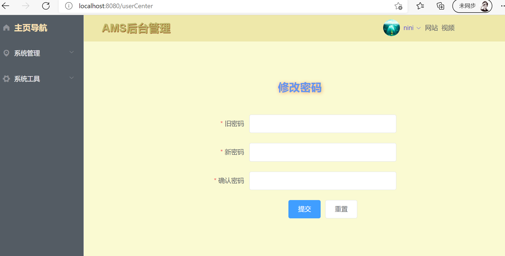

首先在前端页面`Header.vue`中出现`个人中心`链接的地方增加`router-link`:

```vue
<!--下拉菜单-->
<el-dropdown class="dropdown">
  <span class="el-dropdown-link">
    <!--传入用户名-->
    {{userInfo.username}}<i class="el-icon-arrow-down el-icon--right"></i>
  </span>
  <el-dropdown-menu slot="dropdown">
    <el-dropdown-item>
      <!--<router-view></router-view>-->
      <router-link :to="{name: 'userCenter'}">个人中心</router-link>
    </el-dropdown-item>
    <el-dropdown-item>退出</el-dropdown-item>
  </el-dropdown-menu>
</el-dropdown>
```

然后将这个页面作为home页面下的子路由:

```js
{ // 下拉菜单的个人中心页
  path: '/userCenter',
  name: 'userCenter',
  component: ()=> import("@/views/UserCenter.vue")
},
```

编写`UserCenter.vue`页面逻辑：

```vue
<template>
  <div>
    <el-form id="form1" :model="passForm" status-icon :rules="rules" ref="passForm" label-width="100px" class="demo-ruleForm">
      <h2 id="tit1">修改密码</h2>
      <el-form-item label="旧密码" prop="currentPass">
        <el-input type="password" v-model="passForm.currentPass" autocomplete="off"></el-input>
      </el-form-item>
      <el-form-item label="新密码" prop="password">
        <el-input type="password" v-model="passForm.password" autocomplete="off"></el-input>
      </el-form-item>
      <el-form-item label="确认密码" prop="checkPass">
        <el-input type="password" v-model="passForm.checkPass" autocomplete="off"></el-input>
      </el-form-item>
      <el-form-item>
        <el-button type="primary" @click="submitForm('passForm')">提交</el-button>
        <el-button @click="resetForm('passForm')">重置</el-button>
      </el-form-item>
    </el-form>
  </div>
</template>

<script>
export default {
  name: "Home",
  data() {
    var validatePass = (rule, value, callback) => {
      if (value === '') {
        callback(new Error('请再次输入密码'));
      } else if (value !== this.passForm.password) {
        callback(new Error('两次输入的密码不一致!'));
      } else {
        callback();
      }
    };
    return {
      userInfo: {
      },
      passForm: {
        password: '',
        checkPass: '',
        currentPass: ''
      },
      rules: {
        password: [
          { required: true, message: '请输入新密码', trigger: 'blur' },
          { min: 6, max: 12, message: '长度在6到12个字符', trigger: 'blur'}
        ],
        checkPass: [
          { required: true, validator: validatePass, trigger: 'blur' }
        ],
        currentPass: [
          { required: true, message: '请输入当前密码', trigger: 'blur' }
        ]
      }
    };
  },
  created(){
    this.getUserInfo()
  },
  methods: {
    getUserInfo() {
      this.$axios.get("/sys/userInfo").then(res => {
        this.userInfo = res.data.data;
      })
    },
    submitForm(formName) {
      this.$refs[formName].validate((valid) => {
        if (valid) {
          const _this = this
          this.$axios.post('/sys/user/updataPass', this.passForm).then(res => {
            _this.$alert(res.data.msg, '提示', {
              confirmButtonText: '确定',
              callback: action => {
                this.$refs[formName].resetFields();
              }
            });
          })
        } else {
          console.log('error submit!!');
          return false;
        }
      });
    },
    resetForm(formName) {
      console.log("重置")
      this.$refs[formName].resetFields();
    }
  }
}
</script>

<style scoped>
#form1{
  /*text-align: center;*/
  width: 420px;
  margin: -20px auto;
}
#tit1 {
  margin-bottom: -20px;
  color: cornflowerblue;
  text-shadow: 1px 1px 8px sandybrown;
}
</style>
```


#### 3.5.3 下拉菜单--退出

点击下拉菜单中的`退出` 会有对应的退出操作。需要给这个标签增加一个事件。在`Header.vue` 中出现退出的地方增加点击事件：

```vue
<!--下拉菜单-->
<el-dropdown class="dropdown">
  <el-dropdown-menu slot="dropdown">
   
    【由于这个el标签不支持click事件，因此在后面增加native，就可以实现点击事件了】
    <el-dropdown-item @click.native="logout">  
        退出
    </el-dropdown-item>
  </el-dropdown-menu>
</el-dropdown>
```

在 `Header.vue` 中的 script 中编写 `logout` 事件代码：

```vue
<script>
export default {
  name: "Header",
  data(){
    return {   // 向这个页面(头部)返回用户信息
    }
  },
  methods: { // 在methods中定义用户方法
    logout(){                          【自定义这个方法，用于处理退出】
        // 清除缓存状态
        localStorage.clear()
        sessionStorage.clear()
        this.$store.commit("resetState")
        // 进行页面跳转
        this.$router.push("/login")
      })
    },
  },
}
</script>
```

在`store` 全局状态目录中的 `index.js` 文件中编辑 `resetState`方法将全局token 缓存清除：

```js
import Vue from 'vue'
import Vuex from 'vuex'
Vue.use(Vuex)

export default new Vuex.Store({
  state: {  // state中的变量不能直接操作,需要在mutations中解析
    token: ''
  },
  mutations: {
    【 当退出登陆时，这个方法用于清除部分状态变量的缓存
    resetState: (state) => {
      state.token = ''
    }
  },
  actions: {
  },
  modules: {
  }
})
```

在mockjs中模拟创建数据：

```js
// 模拟退出 的数据
Mock.mock('/logout', "post", () =>  {
    return Result
})
```

此时点击会跳回 登录页面


### 3.6 动态导航与动态路由绑定

1. 修改页面，使用json数组修改固定的模板
2. 编辑导航栏 mockjs数据
3. 在store目录文件中创建导航栏的全局参数
4. 在路由文件中编写 导航钩子，进行用户请求拦击
5. 在 SideMenu.vue 侧边导航栏页面中获取 用户信息和导航信息并显示在模板中


####  修改导航栏

下面对左侧导航栏进行修改。

由于最后需要根据用户的权限来显示不同的菜单项，进而显示不同的页面数据。因此不能将左侧的菜单栏如同上面一样写死了。

将 `SideMenu.vue` 中 `<template>` 的 节点简化成 json 数组，然后使用 for 循环展示出来：

```vue
<template>
  <el-menu
      default-active="2"
      class="menu_total el-menu-vertical-demo"
      background-color="#545c64"
      text-color="#fff"
      active-text-color="#ffd04b">
    <!--@open="handleOpen"-->
    <!--@close="handleClose"-->

    <!--导航栏标题-->
    <router-link to="/index">
      <el-menu-item index="0">
        <template slot="title">
          <i class="el-icon-s-home"></i>
          <span><strong class="toolbar-title">主页导航</strong></span>
        </template>
      </el-menu-item>
    </router-link>

    <!--导航栏选项-->      【下面开始同样的显示用json数组循环展示】
    <el-submenu :index="menu.name" v-for="menu in menuList"> 【循环遍历script中的menuList】
      <template slot="title">     
        <i :class="menu.icon"></i>   【将图标改成json数组中的值】
        <span>{{menu.title}}</span>  【将导航名字改成json数组中的值】
      </template>

      <router-link :to="item.path" v-for="item in menu.children"> 【将请求路径改成json值】
        <el-menu-item :index="item.name"> 【将index改成json数组中的值】
          <template slot="title">
            <i :class="item.icon"></i>
            <span>{{item.title}}</span>
          </template>
        </el-menu-item>
      </router-link>

    </el-submenu>
  </el-menu>
</template>

<script>
export default {
  name: "SideMenu",
  data() {
    return {
      menuList: [      【按照原来的导航栏结构构建 图标、标题、请求路径等的json数组】
        {
          // 构建菜单栏的json数组
          name: 'SysMange',
          title: '系统管理',
          icon: 'el-icon-location',
          path: '',
          children: [
            {
              name: 'SysUser',
              title: '用户管理',
              icon: 'el-icon-user',
              path: '/sys/users',
              children: []
            }
          ]
        },
        {
          name: 'SysTools',
          title: '系统工具',
          icon: 'el-icon-s-tools',
          path: '',
          children: [
            {
              name: 'SysDict',
              title: '数字字典',
              icon: 'el-icon-tickets',
              path: '/sys/dicts',
              children: []
            }
          ]
        }
      ]
    }
  },
  methods: {
    
  }
}
</script>

<style scoped>
    ....
</style>
```

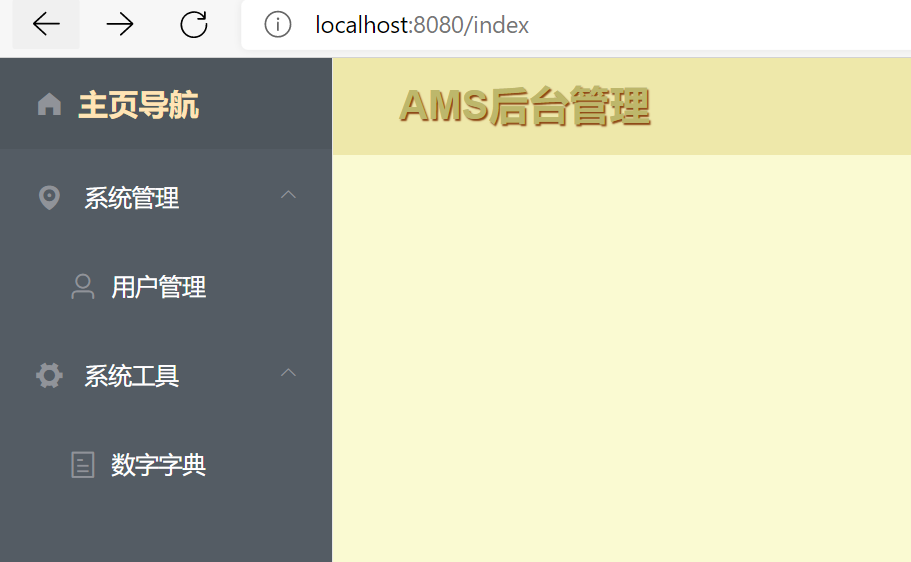


#### 导航栏的mockjs

创建导航栏的mockjs数据，以便之后不同权限的用户显示不同的导航菜单：

其中Result返回的数据包括：导航栏信息 nav 和用户权限信息 authoritys

```js
// 引入mockjs,创建mockjs对象
const Mock = require('mockjs');
// 获取 mock.Random 对象
const Random = Mock.Random;
// 模拟数据的封装
let Result = {
    code: 200,
    msg: '操作成功',
    data: null
};
Mock.mock('/sys/menu/nav', "get", () =>  {
    // nav中是导航栏的信息
    let nav = [
        {
            // 构建菜单栏的json数组
            name: 'SysMange',
            title: '系统管理',
            icon: 'el-icon-location',
            path: '',
            component: '',
            children: [
                {
                    name: 'SysUser',
                    title: '用户管理',
                    icon: 'el-icon-user',
                    path: '/sys/users',
                    component: 'sys/User',
                    children: []
                }
            ]
        },
        {
            name: 'SysTools',
            title: '系统工具',
            icon: 'el-icon-s-tools',
            path: '',
            component: '',
            children: [
                {
                    name: 'SysDict',
                    title: '数字字典',
                    icon: 'el-icon-tickets',
                    path: '/sys/dicts',
                    component: '',
                    children: []
                }
            ]
        }
    ]
    // authoritys是用户权限信息
    let authoritys = []
    // 将两个信息放到返回的结果中
    Result.data = {
        nav: nav,
        authoritys: authoritys
    }
    return Result
})
```


#### 导航钩子拦截用户请求

1. 当要进入主页后根据不用的用户身份应该显示不同的导航栏标题，此时导航栏发起一个请求。

2. 在路由文件`/router/index.js`中根据这个请求获取不同用户的权限信息和应该显示的导航项目，这一步使用`router.beforeEach` 导航钩子来实现
3. 导航钩子拦截router，获取到不同用户的权限，和导航信息后，将这两个信息通过store.state.commit（）传递到store 目录下的全局参数文件中进行缓存：
   - `store.state.commit`：同步操作，将数据提交至 `mutations` 。括号中的参数：
     - 第一个参数：对应文件menus.js的属性mutations中的方法
     - 第二个参数：要传递到mutations方法中对应的参数

```js
import Vue from 'vue'
import VueRouter from 'vue-router'
// 1.手动导入需要使用路由的页面
import Home from '../views/Home.vue'
import Index from '../views/Index.vue'  // 1.默认显示页面
import Login from '../views/Login.vue'  // 2.登录首页
// 2. 导入home页面的sys目录下的子路由
import Menu from "@/views/sys/Menu";
import Role from "@/views/sys/Role";
import User from "@/views/sys/User";
import UserCenter from "@/views/UserCenter";
import {fromJson} from "cli-highlight";
import axios from "axios"
import {reset} from "colorette";
// 导入全局参数的目录store
import store from "../store"            【首先引入store全局状态参数目录】

Vue.use(VueRouter)
// 新增的路由在routes中增加
const routes = [
  {
    path: '/home',
    name: 'Home',
    component: Home,
    children:[   // 创建home页面的子路由
    ]
  }
]
const router = new VueRouter({
  mode: 'history',
  base: process.env.BASE_URL,
  routes
})

// 在这里面判断不同用户的请求路径是否存在
// 首先导入 import axios from "axios"
// 然后编写下面的逻辑
router.beforeEach((to, fromJson,  next) => {【然后编写导航钩子，在跳转前实现权限用户的路径判断】
  // axios.get: 发起获取左侧导航栏信息的请求
  axios.get("/sys/menu/nav", {
    headers: {
      Authorization: localStorage.getItem("token")
    }
  }).then(res => {
    // 从mockjs中获取result返回值: nav和 authoritys
    // 拿到 menuList导航栏标题信息： nav
    store.commit("setMenuList", res.data.data.nav);
    // 拿到用户权限信息: authoritys
    store.commit("setPermList", res.data.data.authoritys);

  })
  next()
})

export default router
```


#### 导航栏的全局参数

获取来自导航钩子的 用户信息和导航信息：

在`store/modules/menus.js`中 编辑属于导航栏组件的 参数及状态，然后将menus.js 引入 store目录下的全局参数状态文件`index.js`中。将导航栏的参数独立到menus.js中的好处是，避免全局参数文件变得冗余复杂，保证了模块与模块之间的参数独立性。 `menus.js`及 `index.js` 中的具体实现如下：

```js
menus.js 全局参数状态文件：
==============================================================
import Vue from 'vue'
import Vuex from 'vuex'
Vue.use(Vuex)
export default{   【注意这里：不用new..】
    state: {  // 导航栏模块使用到的全局参数包括两个: 导航列表,用户权限
        menuList: [],      【导航列表参数】
        permList: []       【用户权限参数】
    },
    mutations: {         
        setMenuList(state, menus) {   【在这里编写操作两个参数的set方法】
            state.menuList = menus
        },
        setPermList(state, perms) {
            state.permList = perms
        }
    },
    actions: {
    }
}
```

```js
index.js 全局参数状态文件：
==============================================================
import Vue from 'vue'
import Vuex from 'vuex'
Vue.use(Vuex)

// 手动引入其他组件模块的参数状态
import menus from "./modules/menus"              【在这里引入导航栏的参数文件】

export default new Vuex.Store({
  state: {  // state中的变量不能直接操作,需要在mutations中解析
    //这里放全局参数
    token: ''
  },
  mutations: {
    //这里是set方法
    // 为了操作state属性中的变量token,自定义一个SET_TOKEN方法
    SET_TOKEN: (state, token) => {  // 将后端传来的token注入state属性进行存储
      state.token = token
      localStorage.setItem("token", token)
    },
    resetState: (state) => {
      state.token = ''
    }
  },
  getters: {
    //get方法
  },
  actions: {
  },
  modules: {
    // 这里是我自己理解的是为了给全局变量分组，
    // 所以需要写提前声明其他store文件，然后引入这里
    menus                                 【在modules中引入导航栏参数】
  }
})
```


#### SideMenu.vue 获取信息

将store 全局参数文件（缓存）中的用户信息和导航标题信息传递到前端vue页面中。将页面中的script 改成下面的样子：

```vue
<script>
export default {
  name: "SideMenu",
  data() {
    return {}
  },
  computed: {       【在computed中获取store全局参数文件中的信息】
    menuList: {     【menuList导航列表信息： 对应menus.js中state的参数名】
      get() {        
        return this.$store.state.menus.menuList 【向模板中返回对应的参数】
      }
    }
  },
  methods: {}
}
</script>
```


此时页面可以正常显示导航栏了：

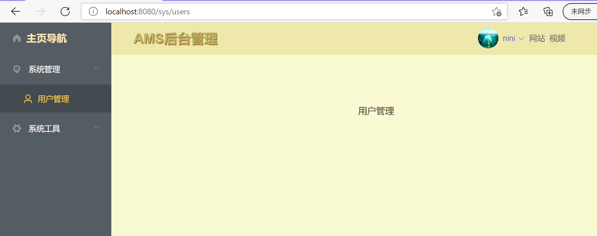


#### 动态绑定路由

首先在`/store/modules/menus.js` 中定义一个全局状态`hasRoute`，用来记录导航栏路由是否更新：

```js
import Vue from 'vue'
import Vuex from 'vuex'
Vue.use(Vuex)
export default{
    state: {
        // 定义一个导航栏相关route 是否更新的标志
        hasRoute: false
    },
    mutations: {
        // 获取导航栏状态是否改变了的方法
        changeRouteStatus(state, hasRoute){
            state.hasRoute = hasRoute
            // sessionStorage.setItem("hasRoute", hasRoute)
        }
    },
    actions: {
    }
}
```


然后在路由文件中动态绑定导航栏路由：

```js
import Vue from 'vue'
import VueRouter from 'vue-router'
import axios from "axios"
// 导入全局参数的目录store
import store from "../store"

Vue.use(VueRouter)

// 新增的路由在routes中增加
const routes = [
  {
    path: '/home',
    name: 'Home',
    component: Home,
    children:[   // 创建home页面的子路由 
      { // 下拉菜单的个人中心页
        path: '/userCenter',
        name: 'userCenter',
        component: UserCenter // ()=> import("@/views/UserCenter.vue")
      },
        【home 有三个子路由：'/sys/users','/sys/roles','/sys/menus',】
        【不在这里写死了，而是在加载页面的时候通过获取用户信息进行这三个子路由的动态绑定】
    ]
  },
]

const router = new VueRouter({
  mode: 'history',
  base: process.env.BASE_URL,
  routes
})

router.beforeEach((to, fromJson,  next) => { 【在beforeEach导航钩子中更新路由】
  // 首先从store中获取hasRoute参数,判断导航栏路由状态是否更新了
  let hasRoute = store.state.menus.hasRoute
  // 如果还没有更新过,则进行更新
  if(!hasRoute){
    // axios.get: 发起获取左侧导航栏信息的请求
    axios.get("/sys/menu/nav", {
        ......代码省略.......
    }).then(res => {
      // 从后端获取result返回值: nav和 authoritys ，即menuList导航列表信息
      store.commit("setMenuList", res.data.data.nav);
       
        ......代码省略.......
        
      // 动态绑定路由
      // 1.首先获取当前的路由newRoutes ,即 const routes ={}
      let newRoutes = router.options.routes    【这一行开始下面每一行都是 路由动态绑定的代码】
      // 2.循环遍历导航栏信息res.data.data.nav,获取其中的子导航项目
      res.data.data.nav.forEach(menu => {
        // 3.判断如果此导航标题有子标题,则绑定每一个子标题的路由
        if(menu.children){
          menu.children.forEach(submenu => {
            // 4.路由转换: 在自定义的方法中实现 获取mockjs中的导航栏信息并转换成route的形式
            let route = menuToRoute(submenu);
            // 5.把路由添加到1获取的当前路由中:
            if (route){
              newRoutes[0].children.push(route)
            }
          })
        }
      })
      // 将当前的新路由添加到 全局的router中
      router.addRoutes(newRoutes)
      // 改变hasRoute的状态
      hasRoute = true
      // 将hasRoute状态更新到changeRouteStatus方法中保存
      store.commit("changeRouteStatus", hasRoute)
    })
  }
  // beforeEach 最后必须要有next()才会跳转
  next()

})

// 自定义实现路由转换的方法
const menuToRoute = (menu) => {
  // 1.首先判断 component 是否为空: 不为空才进行路由转换
  if (!menu.component){ return null;}
  // 2.component不为空,进行路由转换
  let route = {
    // 3.根据mockjs中的数据进行转换[这就是具体的转换过程]
    // name: 'SysUser',
    // title: '用户管理',
    // icon: 'el-icon-user',
    // path: '/sys/users',
    // component: 'sys/User',
    // children: []
    name: menu.name,
    path: menu.path,
    meta: {
      icon: menu.icon,
      title: menu.title
    }
  }
  // 3.component与上面的格式不同,所有进行单独转换
  route.component = () => import('@/views/' + menu.component + '.vue')
  // 4.最后返回转换后的局部路由
  return route
}
export default router
```


此时点击`用户管理`时，导航栏显示的url是`http://localhost:8080/sys/users`。

其中`/sys/users`是 `用户管理`的路由对应的请求。而这个请求是根据传入的用户后台数据动态变更的。

当后台指定`用户管理`对应的路由请求是别的url时，地址栏就会动态更改。

从而实现了不同权限用户的导航栏动态显示。

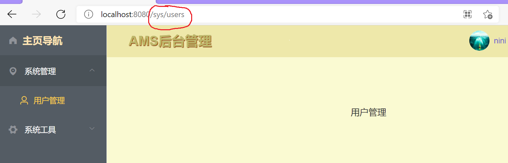


### 3.7 动态标签页

示例：

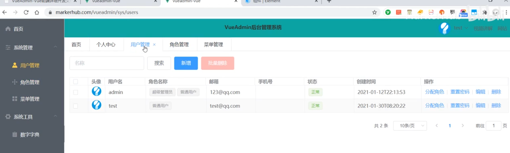


#### Ⅰ. 编辑页面样式

从element 的 `Tabs标签页` 选取基本样式进行diy修改。


在`inc` 目录下，创建`Tabs.vue` ，将这个标签页的代码粘贴如下。这个vue页面将作为一个独立的组件，之后插入home页面中：

```vue
<template>
  <!--el-tabs从element粘贴-->
  <el-tabs v-model="editableTabsValue" type="card" closable @tab-remove="removeTab">
    <el-tab-pane
        v-for="(item, index) in editableTabs"
        :key="item.name"
        :label="item.title"
        :name="item.name" >
    </el-tab-pane>
  </el-tabs>
</template>

<script>
export default {
  name: "Tabs",
  // data()也是从element复制过来的,自己进行部分修改
  data() {
    return {
      editableTabsValue: 'Index',  // 默认显示的标签
      editableTabs: [{
        title: '首页',
        name: 'Index',
      }, {
        title: '用户管理',
        name: 'SysUser',
      }],
      tabIndex: 2
    }
  },
  methods: {
    addTab(targetName) {
      let newTabName = ++this.tabIndex + '';
      this.editableTabs.push({
        title: 'New Tab',
        name: newTabName,
      });
      this.editableTabsValue = newTabName;
    },
    removeTab(targetName) {
      let tabs = this.editableTabs;
      let activeName = this.editableTabsValue;
      if (activeName === targetName) {
        tabs.forEach((tab, index) => {
          if (tab.name === targetName) {
            let nextTab = tabs[index + 1] || tabs[index - 1];
            if (nextTab) {
              activeName = nextTab.name;
            }
          }
        });
      }

      this.editableTabsValue = activeName;
      this.editableTabs = tabs.filter(tab => tab.name !== targetName);
    }
  }
}
</script>
```


在home.vue 这个主页面中，<el-main> 页面主体部分插入`Tabs.vue` 标签页组件：

```vue
<template>
  <el-container id="all">
      ......
    <el-container id="all1">
        .......
      <el-main id="el-main">
        <!--添加标签页-->
        <Tabs></Tabs>                   【3.将Tabs放到home页面中合适的位置】
        <!--当浏览器请求/index会异步显示这部分局部页面-->
        <router-view></router-view>
      </el-main>
    </el-container>
  </el-container>
</template>

<script>
// 1.引入SideMenu 侧边栏的包文件
import SideMenu from "@/views/inc/SideMenu";
import Header from "@/views/inc/Header";
import Tabs from "./inc/Tabs";          【1.声明Tabs组件文件】
export default {
  name: "Home",
  components: {
    Header,
    SideMenu,
    Tabs                                【2.将Tabs.vue加入home页面组件中】                              
  }
}
</script>
```


初步显示效果如下：

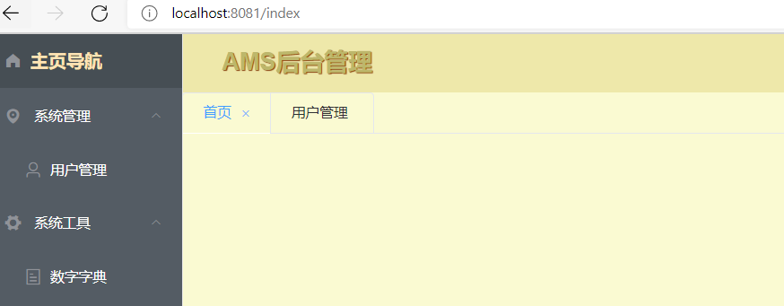


#### Ⅱ. 标签动态显示

在上面的效果中，页面主体部分的两个标签是固定写死的。


为了实现：

- 点击`主页导航` 显示`首页` 标签
- 点击 `用户管理` 显示 `用户管理` 标签

的效果，下面将标签页进行动态修改。


**1、首先实现默认标签的显示：**

将`Tabs.vue` 中return 部分的如下代码作为导航栏相关的全局状态，粘贴到menus.js中：

```js
export default {              【Tabs.vue】
  data() {
    return {
      editableTabsValue: 'Index',  // 默认显示的标签
      editableTabs: [{
        title: '首页',
        name: 'Index',
      }, {
        title: '用户管理',
        name: 'SysUser',
      }],
      tabIndex: 2
    }
  },
}
```

```js
import Vue from 'vue'         【menus.js】
import Vuex from 'vuex'
Vue.use(Vuex)
export default{
    state: {                  【将标签页的相关参数作为全局状态】
        // 标签页动态定制相关的状态  
        editableTabsValue: 'Index', // 默认显示的标签
        editableTabs: [{
            title: '首页',  // 显示的标签标题
            name: 'Index',  // 显示的标签name
        }],
    },
}
```

然后将`Tabs.vue`中 return 里获取标签参数的代码删除；增加 `computed` 来动态监听 标签状态值的变化：

```js
export default {
  name: "Tabs",
  data() {
    return {}
  },
  // computed 可以动态监听值的变化: get() 和 set() 要一起出现
  computed: {          
    editableTabs: {       【监听store中全局参数的变化】
      get() {             【获取store中新的状态值】
        return this.$store.state.menus.editableTabs
      },
      set(val) {
        this.$store.state.menus.editableTabs = val
      }
    },
    editableTabsValue: {  【监听store中全局参数的变化】
      get() {             【获取store中新的状态值】
        this.$store.state.menus.editableTabsValue
      },
      set(val) {
        this.$store.state.menus.editableTabsValue = val
      }
    }
  },
}
```

现在`首页`这个标签是默认显示的：

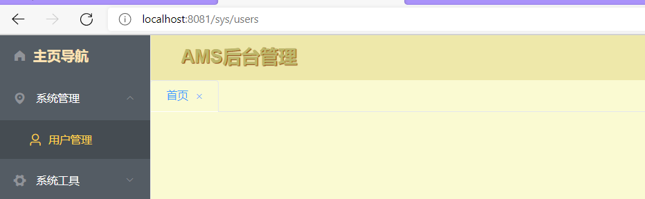


**2、下面需要实现的是：**

点击`用户管理` 然后在标签栏 新增一个标签：`用户管理`

首先将 `Tabs.vue` 中动态添加标签的代码复制到全局状态 `menus.js` 中：

```js
export default{                        【menus.js】
    state: {
        // 标签页动态定制相关的状态
        editableTabsValue: 'Index',
        editableTabs: [{
            title: '首页',
            name: 'Index',
        }],
    },
    mutations: {
        // addTab(): 动态添加标签: 
        // 修改state参数表中的参数 editableTabs 和 editableTabsValue
        addTab(state, tab) {           【复制并修改的动态添加标签的方法】
            state.editableTabsValue = tab.name; // 必须使用state.变量
            state.editableTabs.push({
                title: tab.title,
                name: tab.name,
            });
        },
    },
}
```


然后在 `SideMenu.vue` 中增加点击事件：

```vue
<template>
  <!--<el-menu>中 :default-active 使得动态标签有高亮的显示效果-->
  <el-menu
      :default-active="this.$store.state.menus.editableTabsValue" 
      class="menu_total el-menu-vertical-demo"
      background-color="#545c64"
      text-color="#fff"
      active-text-color="#ffd04b">
      
    <!--导航栏标题-->
      ......

    <!--导航栏选项-->
    <el-submenu :index="menu.name" v-for="menu in menuList">
        ......
      <router-link :to="item.path" v-for="item in menu.children">
        <el-menu-item :index="item.name" @click="selectMenu(item)"> 
            ......                   【新增click事件⬆：点击导航栏title触发事件】
        </el-menu-item>
      </router-link>
    </el-submenu>
  </el-menu>
</template>

<script>
export default {
  name: "SideMenu",
  data() {},
    ......
  methods: {
    // 通过点击事件 向store参数表中传递 标签栏参数
    selectMenu(item){    【触发click事件：将导航栏title信息item提交到state全局状态表】
      this.$store.commit("addTab", item)
    }
  }
}
</script>

```


此时可以动态增加标签，也能删除：

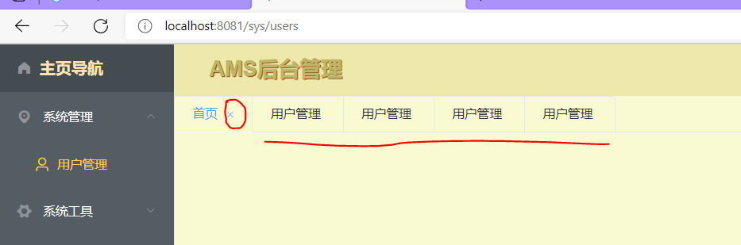


#### Ⅲ. 增加导航栏标签

在mockjs中增加角色管理和菜单管理的数据：

```js
Mock.mock('/sys/menu/nav', "get", () =>  {
    // nav中是导航栏的信息
    let nav = [
        {
            // 构建菜单栏的json数组
            name: 'SysMange',
            title: '系统管理',
            icon: 'el-icon-location',
            path: '',
            component: '',
            children: [
                ......
                {
                    name: 'SysRole',
                    title: '角色管理',
                    icon: 'el-icon-view',
                    path: '/sys/roles',
                    component: 'sys/Role',
                    children: []
                },
                {
                    name: 'SysMenu',
                    title: '菜单管理',
                    icon: 'el-icon-menu',
                    path: '/sys/menus',
                    component: 'sys/Menu',
                    children: []
                },

            ]
        },
```

此时可以正常显示出：`角色管理` `菜单管理`

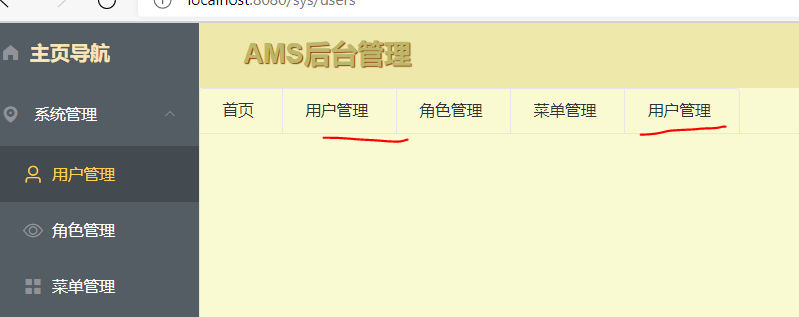


#### Ⅳ. 重复标签优化

在上面的显示效果中，相同标签点击后出现了多次。

但是应该只出现一次。

因此进行优化。


在`menus.js`全局状态参数中及进行优化：

```js
mutations: {
    // addTab(): 动态添加标签的方法
    addTab(state, tab) {
        //index = -1 表示此标签还没有出现过 【新增】
        let index = state.editableTabs.findIndex(e => e.name === tab.name) 
        if (index === -1){
            state.editableTabs.push({
                title: tab.title,
                name: tab.name,
            });
        }
        state.editableTabsValue = tab.name;  
    },
},
```


#### Ⅴ. 标签页的其他bug

修改App.vue，增加下面的代码：

```vue
<script>
  export default {
    name: "App",
    watch: {
      $route(to, from){
        if (to.path != '/login'){
          let obj = {
            name: to.name,
            title: to.meta.title
          }
          this.$store.commit("abbTab", obj)
        }
      }
    }
  }
</script>
```


下拉菜单 `退出` 后，清除所有状态：

menus.js中增加方法：

```js
// 下拉菜单的退出
resetState: (state) => {
    state.menuList = []
    state.permList = []
    state.hasRoute = false
    state.editableTabsValue = 'Index'
    state.editableTabsValue = 'Index'
    state.editableTabs = [{
        title: '首页',
        name: 'Index',
    }]
}
```


### 3.8 菜单管理界面

#### Ⅰ. 修改样式：页面主体靠左显示

首先将页面主体设置为靠左显示，保留左右边界

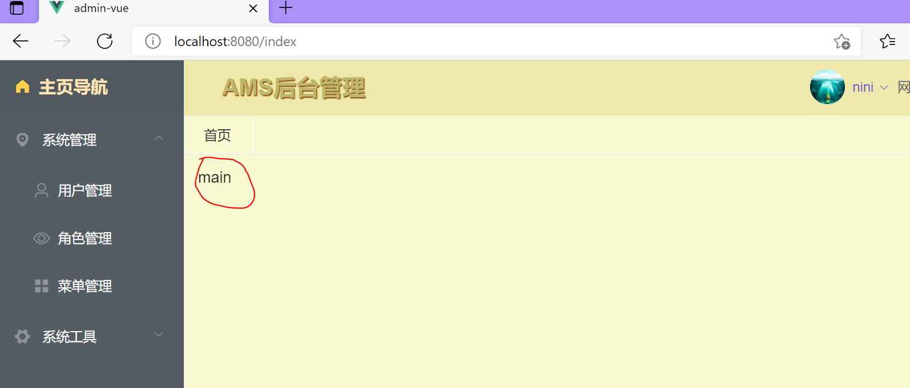

```vue
<template>
  <el-container id="all">
      ......
    <el-container id="all1">
        ......
      <el-main id="el-main">
        <!--添加标签页-->
        <Tabs></Tabs>
        <div style="margin: 0 15px;">  【设置边界】
          <router-view/>
        </div>
      </el-main>
    </el-container>
  </el-container>
</template>

<script>
.....
</script>

<!--css 样式表 =====================================-->
<style scoped>
/*设置右下主界面*/
#el-main {
  text-align: left; /*靠左侧显示*/;
}

</style>
```


#### Ⅱ. 增加主体部分树形表格

页面最上方会有一些搜索框或者按钮，这里选择并设置为行内表单

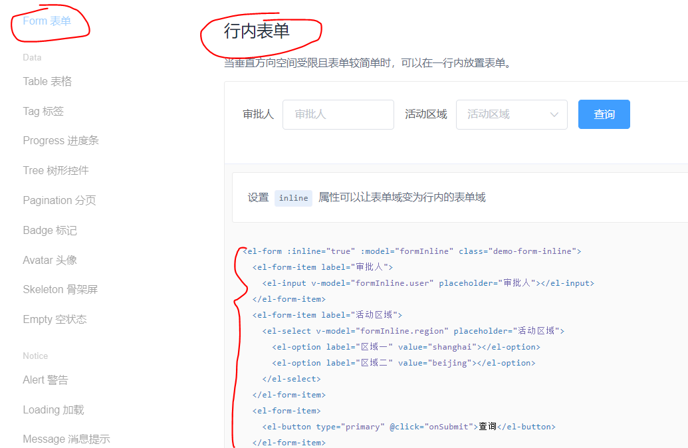


然后在`element` 中选择树形表格：


下面编辑自己的代码：在`Menu.vue`中编辑表单样式

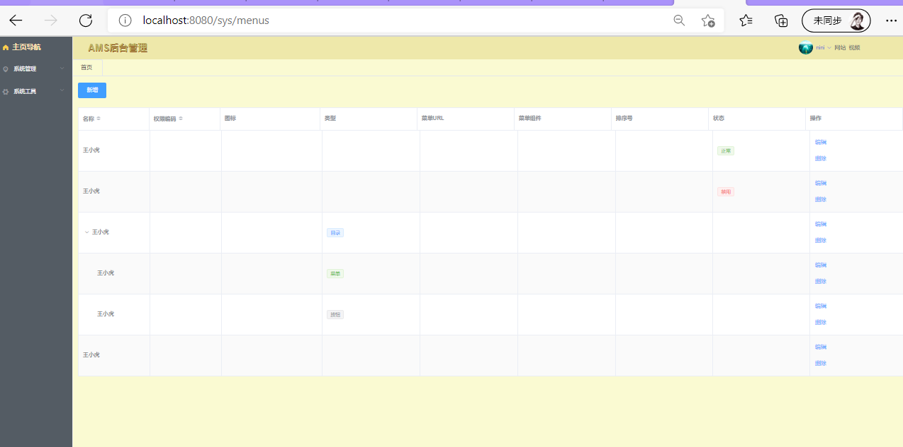

```vue
<template>
  <div>
    <!--行内表单部分-->
    <el-form :inline="true">
      <el-form-item>
        <el-button type="primary" @click="onSubmit">新增</el-button>
      </el-form-item>
    </el-form>
    <!--树形表单部分-->
    <el-table
        :data="tableData"
        style="width: 100%;margin-bottom: 20px;"
        row-key="id"
        border
        stripe
        default-expand-all
        :tree-props="{children: 'children', hasChildren: 'hasChildren'}">
      <!--el-table标签的属性说明
       row-key与表单的每一行有关
      :data表示从<script>中传来的数据
      border表示有边框的
      stripe表示行与行之间有斑马线的效果
      -->
      <el-table-column
          prop="name"
          label="名称"
          sortable
          width="180">
      </el-table-column>
      <el-table-column
          prop="perm"
          label="权限编码"
          sortable
          width="180">
      </el-table-column>
      <el-table-column
          prop="icon"
          label="图标">
      </el-table-column>
      <el-table-column
          prop="type"
          label="类型">
        <!--采用饿了么表单中的插槽属性,-->
        <template slot-scope="scope">
          <el-tag size="small" v-if="scope.row.type === 0">目录</el-tag>
          <el-tag size="small" v-else-if="scope.row.type === 1" type="success">菜单</el-tag>
          <el-tag size="small" v-else-if="scope.row.type === 2" type="info">按钮</el-tag>
        </template>
      </el-table-column>
      <el-table-column
          prop="path"
          label="菜单URL">
      </el-table-column>
      <el-table-column
          prop="component"
          label="菜单组件">
      </el-table-column>
      <el-table-column
          prop="orderNum"
          label="排序号">
      </el-table-column>
      <el-table-column
          prop="statu"
          label="状态">
        <!--采用饿了么表单中的插槽属性,-->
        <template slot-scope="scope">
          <el-tag size="small" v-if="scope.row.statu === 1" type="success">正常</el-tag>
          <el-tag size="small" v-else-if="scope.row.statu === 0" type="danger">禁用</el-tag>
        </template>
      </el-table-column>
      <el-table-column
          prop="icon"
          label="操作">
        <!--采用饿了么表单中的插槽属性,-->
        <template slot-scope="scope">
          <el-button type="text">编辑</el-button>
          <el-divider direction="vertial"></el-divider>
          <el-button type="text">删除</el-button>
        </template>
      </el-table-column>

    </el-table>
  </div>
</template>

<script>
export default {
  name: "Menu",
  data() {
    return {
      tableData: [{
        id: 1,
        date: '2016-05-02',
        name: '王小虎',
        address: '上海市普陀区金沙江路 1518 弄',
        statu: 1
      }, {
        id: 2,
        date: '2016-05-04',
        name: '王小虎',
        address: '上海市普陀区金沙江路 1517 弄',
        statu: 0
      }, {
        id: 3,
        date: '2016-05-01',
        name: '王小虎',
        address: '上海市普陀区金沙江路 1519 弄',
        type: 0,
        children: [{
          id: 31,
          date: '2016-05-01',
          name: '王小虎',
          address: '上海市普陀区金沙江路 1519 弄',
          type: 1
        }, {
          id: 32,
          date: '2016-05-01',
          name: '王小虎',
          address: '上海市普陀区金沙江路 1519 弄',
          type: 2
        }]
      }, {
        id: 4,
        date: '2016-05-03',
        name: '王小虎',
        address: '上海市普陀区金沙江路 1516 弄'
      }],
    }
  }
}
</script>
<style scoped>
</style>
```


#### Ⅲ. 点击按钮显示表格弹窗

点击页面中的按钮`新增`，首先会弹出一个对话框；

然后将这个对话框变成一个表格的样式。

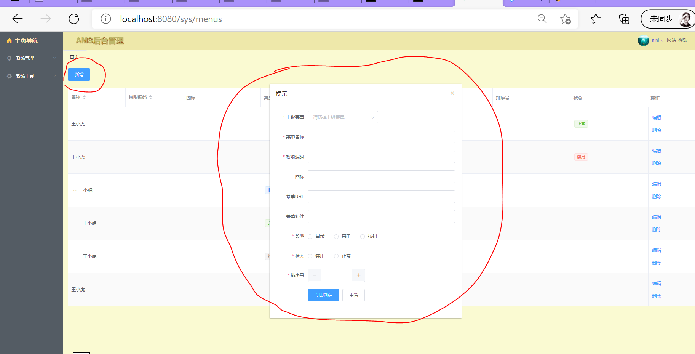

样式修改如下：

```vue
<template>
  <div>
    <!--行内表单部分-->
      ......
    <!--树形表单部分-->
      ......

    <!--弹窗:  参数说明:
    :visible.sync="dialogVisible" 对话框是否显示 -->
    <el-dialog
        title="提示"
        :visible.sync="dialogVisible"
        width="600px"
        :before-close="handleClose">
      <!--在弹窗中显示表单-->
      <el-form :model="editForm" :rules="editFormRules" ref="editForm" label-width="100px" class="demo-editForm">
        <el-form-item label="上级菜单" prop="parentId">
          <el-select v-model="editForm.parentId" placeholder="请选择上级菜单">
            <template v-for="item in tableData">
              <el-option :label="item.name" :value="item.id"></el-option>
              <template v-for="child in item.children">
                <el-option :label="child.name" :value="child.id">
                  <span>{{"- " + child.name}}</span>
                </el-option>
              </template>
            </template>
          </el-select>
        </el-form-item>
        <el-form-item label="菜单名称" prop="name" label-width="100px">
          <el-input v-model="editForm.name" autocomlete="off"></el-input>
        </el-form-item>

        <el-form-item label="权限编码" prop="perms" label-width="100px">
          <el-input v-model="editForm.perms" autocomlete="off"></el-input>
        </el-form-item>

        <el-form-item label="图标" prop="icon" label-width="100px">
          <el-input v-model="editForm.icon" autocomlete="off"></el-input>
        </el-form-item>

        <el-form-item label="菜单URL" prop="path" label-width="100px">
          <el-input v-model="editForm.path" autocomlete="off"></el-input>
        </el-form-item>

        <el-form-item label="菜单组件" prop="component" label-width="100px">
          <el-input v-model="editForm.component" autocomlete="off"></el-input>
        </el-form-item>

        <el-form-item label="类型" prop="type" label-width="100px">
          <el-radio-group v-model="editForm.type">
            <el-radio :label=0>目录</el-radio>
            <el-radio :label=1>菜单</el-radio>
            <el-radio :label=2>按钮</el-radio>
          </el-radio-group>
        </el-form-item>

        <el-form-item label="状态" prop="statu" label-width="100px">
          <el-radio-group v-model="editForm.statu">
            <el-radio :label=0>禁用</el-radio>
            <el-radio :label=1>正常</el-radio>
          </el-radio-group>
        </el-form-item>

        <el-form-item label="排序号" prop="orderNum" label-width="100px">
          <el-input-number v-model="editForm.orderNum" :min="1" label="排序号">1</el-input-number>
        </el-form-item>

        <el-form-item>
          <el-button type="primary" @click="submitForm('editForm')">立即创建</el-button>
          <el-button @click="resetForm('editForm')">重置</el-button>
        </el-form-item>
      </el-form>

    </el-dialog>

  </div>
</template>

<script>
export default {
  name: "Menu",
  data() {
    return {
      dialogVisible: false,  // 弹出的对话框默认不显示

      editForm: { // 弹窗中的表格

      },

      editFormRules: { //弹窗表单的校验规则
        parentId: [
          {required: true, message: '请选择上级菜单', trigger: 'blur'}
        ],
        name: [
          {required: true, message: '请输入名称', trigger: 'blur'}
        ],
        perms: [
          {required: true, message: '请输入权限密码', trigger: 'blur'}
        ],
        type: [
          {required: true, message: '请选择类型', trigger: 'blur'}
        ],
        orderNum: [
          {required: true, message: '请填入排序号', trigger: 'blur'}
        ],
        statu: [
          {required: true, message: '请选择状态', trigger: 'blur'}
        ],
      },
    }
  }
}
</script>

<style scoped>
</style>
```


#### Ⅳ. 主体界面的js操作

上面的三个步骤完成了页面样式的搭建，下面编写js代码，实现数据获取传输等操作。


##### 1、在菜单界面主体获取mockjs中的内容

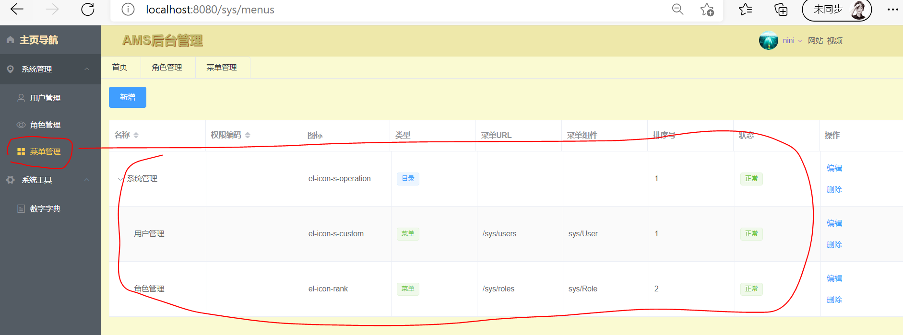

首先在mockjs中创建菜单模拟数据：

```js
// 菜单管理界面主体部分,树形表单项数据模拟
Mock.mock('/sys/menu/list', 'get', ()=>{
    let menus = [
        {
            "id": 1,
            "created": "2021-01-15T18:58:18",
            "updated": "2021-01-15T18:58:20",
            "statu": 1,
            "parentId": 0,
            "name": "系统管理",
            "path": "",
            "perms": "sys:manage",
            "component": "",
            "type": 0,
            "icon": "el-icon-s-operation",
            "orderNum": 1,
            "children": [
                {
                    "id": 2,
                    "created": "2021-01-15T19:58:18",
                    "updated": "2021-01-15T19:58:20",
                    "statu": 1,
                    "parentId": 1,
                    "name": "用户管理",
                    "path": "/sys/users",
                    "perms": "sys:user:list",
                    "component": "sys/User",
                    "type": 1,
                    "icon": "el-icon-s-custom",
                    "orderNum": 1,
                    "children": []
                },
                {
                    "id": 3,
                    "created": "2021-01-15T20:58:18",
                    "updated": "2021-01-15T20:58:20",
                    "statu": 1,
                    "parentId": 1,
                    "name": "角色管理",
                    "path": "/sys/roles",
                    "perms": "sys:role:list",
                    "component": "sys/Role",
                    "type": 1,
                    "icon": "el-icon-rank",
                    "orderNum": 2,
                    "children": []
                },
            ]
        }
    ]
    Result.data = menus
    return Result
})
```


然后修改menu.vue的js代码，获取后端数据：

```js
<script>
export default {
  name: "Menu",
  data() {
    return {
      ....其他参数省略... 
      
      tableData: [] //【6、返回树形表单的内容】
    }
  },
  created(){        //【4、在created调用自定义的方法】
    this.getMenuTree() //【5、调用自定义的获取树形表单数据的方法】 
  },
  methods:{         //【1、methods中自定义方法】 
    getMenuTree(){  //【2、自定义的获取树形表单数据的方法】
                    //【3、axios获取后端数据并放入tableData变量中】 
      this.$axios.get("/sys/menu/list").then(res => {
        this.tableData = res.data.data
      })
    }
  }
}
</script>
```

最终显示效果图如上。


##### 2、弹出框中的表单提交

- 点击主体界面的`新增` 按钮，编辑新的表单信息后，点击表单下方的`提交 `，应该将增加的数据更新到后台
- 同时应该将更新的表单内容重新加载在主体部分的树形表单中

```js
【mockjs 模拟这个表单提交后的返回结果】
// 菜单主界面  新增后 提交后的返回值。一定要有返回值，不然无法提交显示效果
Mock.mock(RegExp('/sys/menu/*'), 'post', ()=>{
    return Result
})
```

```vue
【Menu.vue】
<!--弹窗 -->   
<el-dialog ... >
    <el-form-item>
      <el-button type="primary" @click="submitForm('editForm')"> 
          【点击submitForm('editForm')方法提交表单内容】
          提交
      </el-button>
      <el-button @click="resetForm('editForm')">重置</el-button>
    </el-form-item>
  </el-form>

</el-dialog>
======================================================================
<script>
export default {
  name: "Menu",
  data() {
    return {
      dialogVisible: false,  // 弹出的对话框默认不显示
      editForm: { // 弹窗中的表格

      },
        ............
      // 树形表单的内容
      tableData: []
    }
  },

  created(){
    this.getMenuTree() // 创建一个获取树形表单数据的方法
  },
  methods:{
    getMenuTree(){  // 从mockjs中获取树形表单的模拟数据的方法
        ............
    },
    submitForm(formName){ //【弹窗表单数据提交到后台,并更新页面显示 的方法】
      this.$refs[formName].validate((valid) =>{
        // 判断表单数据是否有效
        if (valid){
          this.$axios.post('/sys/menu/' + (this.editForm.id? 'update': 'save'), this.editForm).then(res => {
              this.$message({
                showClose: 'true',
                message: '恭喜你, 操作成功',
                type: 'success',
                onClose:() =>{  // 回调后端信息
                  this.getMenuTree() // 重新获取后端传来的表单数据
                }
              });
              this.dialogVisible = false;
            })
        }else{
          console.log('error submit !');
          return false;
        }
      });
    },
  }
}
</script>
```


##### 3、主体界面树形表单的 `编辑`按钮

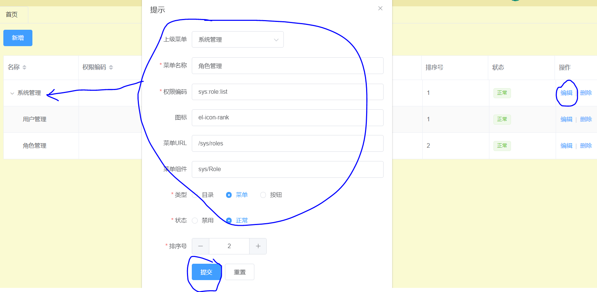

`编辑`按钮的ui实现与上面按钮的实现类似

1. 点击编辑按钮，弹出上面的表格对话框

2. 对话框中直接获取到本行的表格信息并显示

3. 对弹窗表格中的信息进行修改后，点击提交，成功将信息更新到后台

4. 调用树形表格显示事件，显示更新后的全部表格信息

```vue
【Menu.vue】
      <el-table-column
          prop="icon"
          label="操作">
        <!--采用饿了么表单中的插槽属性,-->
        <template slot-scope="scope">
          <el-button type="text" @click="editHandle(scope.row.id)">【1.点击触发方法】
              编辑
          </el-button>

          <!--弹框再次确认删除-->

      </el-table-column>
===============================================================================
<script>
export default {
  name: "Menu",
  data() {
    return {
      dialogVisible: false,  // 弹出的对话框默认不显示

      editForm: { // 弹窗中的表格
      },
        .......
      // 树形表单的内容
      tableData: []
    }
  },

  created(){
    this.getMenuTree() // 创建一个获取树形表单数据的方法
  },
  methods:{
    getMenuTree(){  // 从mockjs中获取树形表单的模拟数据的方法
        ......
    },
    submitForm(formName){ // 【3.4弹窗表单数据提交到后台,并更新页面显示 的方法】
        ......代码在上一节，这里省略......
    },
    editHandle(id){  // 【点击`编辑`按钮后触发这个事件】  
                     // 先通过下面的请求获取这一行的基本信息
      this.$axios.get('/sys/menu/info/' + id).then(res => {
                     // 【2.将获取到的这个信息传入对话框  并显示对话框】
        this.editForm = res.data.data 
        this.dialogVisible = true
      })
    }
  }
}
</script>
```

```js
【在mockjs中模拟上面操作的后端响应结果】
// 模拟主体界面  编辑  更新本行数据后的结果
Mock.mock(RegExp('/sys/menu/info/*'), 'get', ()=>{ 【axios通过这个请求来匹配响应】
    Result.data = {
        "id": 3,
        "statu": 1,
        "parentId": 1,
        "name": "角色管理",
        "path": "/sys/roles",
        "perms": "sys:role:list",
        "component": "sys/Role",
        "type": 1,
        "icon": "el-icon-rank",
        "orderNum": 2,
        "children": []

    }
    return Result
})
```


##### 4、清空弹窗中表单

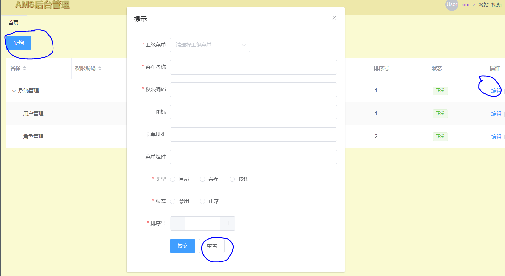

- 直接打开弹窗，里面的表格应该为空表格
- 避免编辑后再次点击新增按钮还会显示非空表格

```vue
【Menu.vue】
<template>
  <div>
    <!--行内表单部分-->
    <el-form :inline="true">
        ......省略......
        【1. @click="newopen('editForm'): 点击按钮,弹窗中表格清空并显示】
        <el-button type="primary" @click="newopen('editForm')">新增</el-button>
        ......省略......
    </el-form>


    <!--弹窗: -->
    <el-dialog>
          ......省略......
        【2. @click: 点击按钮,弹窗中表格清空重置并显示】
          <el-button @click="resetForm('editForm')">重置</el-button>
          ......省略......
    </el-dialog>
  </div>
</template>

<script>
export default {
  name: "Menu",
  data() {
    return {
      dialogVisible: false,       // 弹出及表格默认不显示
      editForm: {                 // 弹窗中的表格的所有数据
      },
    }
  },
  methods:{
    ......省略......
    // 【重置或者清除弹窗中表单内容的方法】
    resetForm(formName){
      this.$refs[formName].resetFields(); //清空表单
      this.dialogVisible = true;  // 隐藏弹窗
      this.editForm = {}          // 将装载表单数据的变量设置为null
    },
    // 【点击新增的时候,清空弹窗表格,显示空白表格】
    newopen(formName){
      this.dialogVisible = true;  // 隐藏弹窗
      this.$refs[formName].resetFields(); //清空表单
      this.editForm = {}          // 将装载表单数据的变量设置为null
    },
  }
}
</script>
```


##### 5、点击`删除` 按钮清除表格项

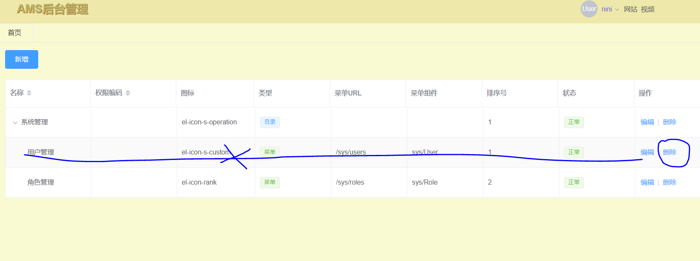

```vue
<template>
  <div>
    <!--树形表单部分-->
    <el-table>
        .....省略.....
            【1.@confirm是饿了么中一个内置事件,意思是:点击确认按钮时触发.(触发删除事件)】
            <el-popconfirm title="是否删除?" @confirm="delHandle(scope.row.id)">
              <el-button type="text" slot="reference">删除</el-button>
            </el-popconfirm>
        .....省略.....
    </el-table>

  </div>
</template>

<script>
export default {
  name: "Menu",
  data() {
    return {
      dialogVisible: false,    // 弹出的对话框默认不显示的参数
      editForm: {              // 弹窗中的表格数据参数
      },
    }
  },
  methods:{                          
    delHandle(id){             // 【2.点击`删除` 按钮清除表格项】
      this.$axios.post('/sys/menu/delete/' + id).then(res => {
        this.$message({
          showClose: 'true',
          message: '恭喜你, 操作成功',
          type: 'success',
          onClose:() =>{       // 回调后端信息
            this.getMenuTree() // 重新获取后端传来的表单数据
          }
        });
      })
    }
  }
}
</script>

```


### 3.9 角色管理界面的开发

类似于3.8，代码复用了一些

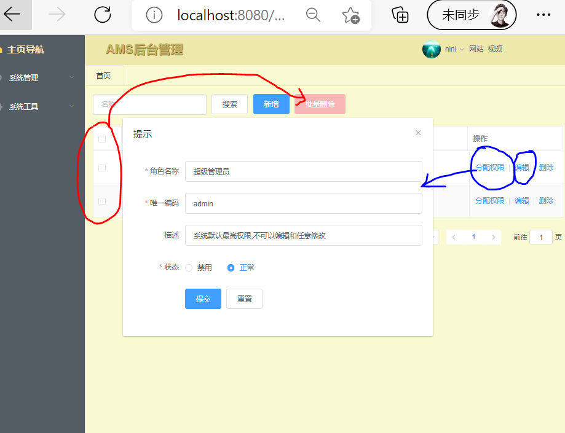


#### Ⅰ. 样式构建及部分js功能

##### 1. 样式搭建及部分js交互功能

- 新增按钮：复用3.8
- 批量删除
- 删除： 复用3.8
- 搜索

```java
<template>
  <div>
    <!--============================行内表单部分==========================-->
    <el-form :inline="true">

      <!-- el-input输入框:
        v-model="searchForm.name": 绑定输入框中的参数为searchForm.name
        placeholder="名称":输入框中默认显示的提示文本
        clearable : 支持清除    -->
      <el-form-item>
        <el-input
            v-model="searchForm.name"
            placeholder="名称"
            clearable>
        </el-input>
      </el-form-item>

      <!--搜索按钮-->
      <el-form-item>
        <el-button @click="getRoleList">搜索</el-button>
      </el-form-item>

      <!--新增按钮-->
      <el-form-item>
        <el-button type="primary" @click="dialogVisible=true">新增</el-button>
      </el-form-item>

      <!--@confirm是饿了么中一个内置事件,意思是:点击确认按钮时触发.(触发删除事件)-->
      <el-popconfirm title="是否批量删除?" @confirm="delHandle(null)">
        <el-button type="danger" slot="reference" :disabled="delBtlStatu">批量删除</el-button>
      </el-popconfirm>

    </el-form>

    <!--============================主体表格部分==========================-->
    <el-table
        ref="multipleTable"
        :data="tableData"
        tooltip-effect="dark"
        style="width: 100%"
        border
        stripe
        @selection-change="handleSelectionChange">
      <el-table-column
          type="selection"
          width="55">
      </el-table-column>

      <el-table-column
          prop="name"
          label="名称"
          width="120">
      </el-table-column>

      <el-table-column
          prop="code"
          label="唯一编码"
          show-overflow-tooltip>
      </el-table-column>

      <el-table-column
          prop="remark"
          label="描述"
          show-overflow-tooltip>
      </el-table-column>

      <el-table-column
          prop="statu"
          label="状态">
        <!--采用饿了么表单中的插槽属性,-->
        <template slot-scope="scope">
          <el-tag size="small" v-if="scope.row.statu === 1" type="success">正常</el-tag>
          <el-tag size="small" v-else-if="scope.row.statu === 0" type="danger">禁用</el-tag>
        </template>
      </el-table-column>

      <el-table-column
          prop="icon"
          label="操作">
        <!--采用饿了么表单中的插槽属性,-->
        <template slot-scope="scope">
          <el-button type="text" @click="editHandle(scope.row.id)">分配权限</el-button>
          <el-divider direction="vertical"></el-divider>
          <el-button type="text" @click="editHandle(scope.row.id)">编辑</el-button>
          <el-divider direction="vertical"></el-divider>
          <!--弹框再次确认删除-->
          <template>
            <!--@confirm是饿了么中一个内置事件,意思是:点击确认按钮时触发.(触发删除事件)-->
            <el-popconfirm title="是否删除?" @confirm="delHandle(scope.row.id)">
              <el-button type="text" slot="reference">删除</el-button>
            </el-popconfirm>
          </template>
        </template>
      </el-table-column>

    </el-table>


    <!--============================分页部分==========================-->
    <el-pagination
        @size-change="handleSizeChange"
        @current-change="handleCurrentChange"
        layout="total, sizes, prev, pager, next, jumper"
        :page-sizes="[10, 20, 50, 100]"
        :current-page="current"
        :page-size="size"
        :total="total">
    </el-pagination>

    <!--============================弹窗部分==========================-->
    <el-dialog
        title="提示"
        :visible.sync="dialogVisible"
        width="600px"
        :before-close="handleClose" >

      <!--在弹窗中显示表单-->
      <el-form :model="editForm" :rules="editFormRules" ref="editForm" label-width="100px" class="demo-editForm">
        <el-form-item label="角色名称" prop="name" label-width="100px">
          <el-input v-model="editForm.name" autocomlete="off"></el-input>
        </el-form-item>

        <el-form-item label="唯一编码" prop="code" label-width="100px">
          <el-input v-model="editForm.code" autocomlete="off"></el-input>
        </el-form-item>

        <el-form-item label="描述" prop="remark" label-width="100px">
          <el-input v-model="editForm.remark" autocomlete="off"></el-input>
        </el-form-item>

        <el-form-item label="状态" prop="statu" label-width="100px">
          <el-radio-group v-model="editForm.statu">
            <el-radio :label=0>禁用</el-radio>
            <el-radio :label=1>正常</el-radio>
          </el-radio-group>
        </el-form-item>

        <el-form-item>
          <el-button type="primary" @click="submitForm('editForm')">提交</el-button>
          <el-button @click="resetForm('editForm')">重置</el-button>
        </el-form-item>
      </el-form>

    </el-dialog>


  </div>
</template>

<script>
export default {
  name: "Role",
  data() {
    return {
      // searchForm  delBtlStatu是行内表单的参数===========
      searchForm : {},
      delBtlStatu: true,

      // tableData 是主体表格的参数========================
      tableData: [],
      multipleSelection: [], //用于批量删除的变量

      // 分页部分的参数 ==================================
      total: 0,
      size: 10,
      current: 1,

      // 弹窗部分的参数===================================
      dialogVisible: false,  // 弹窗是否显示
      editForm: {            // 弹窗表格数据
      },
      editFormRules: {       //弹窗表单的校验规则
        name: [
          {required: true, message: '请输入角色名称', trigger: 'blur'}
        ],
        code: [
          {required: true, message: '请输入唯一编码', trigger: 'blur'}
        ],
        statu: [
          {required: true, message: '请选择状态', trigger: 'blur'}
        ],
      },


    }
  },
  // 使用created钩子,在html完成渲染前调用下面的方法显示后端数据
  created() {
    this.getRoleList();
  },
  methods: {
    // 行内表单部分的方法===================================================
    toggleSelection(rows) {
      if (rows) {
        rows.forEach(row => {
          this.$refs.multipleTable.toggleRowSelection(row);
        });
      } else {
        this.$refs.multipleTable.clearSelection();
      }
    },
    handleSelectionChange(val) {
      console.log(val);
      this.multipleSelection = val;
      // 根据选项数组的长度判断是否将 批量删除的按钮禁用
      this.delBtlStatu = (val.length === 0);
    },

    // 分页部分的方法 ======================================================
    handleSizeChange(val) {
      console.log(`每页 ${val} 条`);
      this.size = val;
      this.getRoleList();
    },
    handleCurrentChange(val) {
      console.log(`当前页: ${val}`);
      this.current = val;
      this.getRoleList();
    },

    // 弹窗部分的方法 =====================================================
    // 重置或者清除弹窗中表单内容的方法
    resetForm(formName){
      this.$refs[formName].resetFields(); //清空表单
      this.dialogVisible = true;  // 隐藏弹窗
      this.editForm = {}  // 将装载表单数据的变量设置为null
    },

    // 点击新增的时候,清空弹窗表格,显示空白表格
    newopen(formName){
      this.dialogVisible = true;  // 隐藏弹窗
      this.$refs[formName].resetFields(); //清空表单
      this.editForm = {}  // 将装载表单数据的变量设置为null
    },

    getRoleList(){  // 从mockjs中获取表单主体内容的模拟数据的方法
      this.$axios.get("/sys/role/list", {
        params: {
          name: this.searchForm.name,
          current: this.current,
          size : this.size
        }
      }).then(res => {
        this.tableData = res.data.data.records
        this.size = res.data.data.size
        this.current = res.data.data.current
        this.total = res.data.data.total
      })
    },

    submitForm(formName){ //弹窗表单数据提交到后台,并更新页面显示 的方法
      this.$refs[formName].validate((valid) =>{
        // 判断表单数据是否有效
        if (valid){
          this.$axios.post('/sys/role/' + (this.editForm.id? 'update': 'save'), this.editForm).then(res => {
            this.$message({
              showClose: 'true',
              message: '恭喜你, 操作成功',
              type: 'success',
              onClose:() =>{  // 回调后端信息
                this.getRoleList() // 重新获取后端传来的表单数据
              }
            });
            this.dialogVisible = false;
          })
        }else{
          console.log('error submit !');
          return false;
        }
      });
    },
    editHandle(id){  // 点击`编辑`按钮后触发这个事件
      // 先通过下面的请求获取这一行的基本信息
      this.$axios.get('/sys/role/info/' + id).then(res => {
        // 将获取到的这个信息传入对话框  并显示对话框
        this.editForm = res.data.data
        this.dialogVisible = true
      })
    },

    // 点击`删除` 按钮清除表格项
    // 注意这里可能是批量删除,所以需要将id放入一个数组,而不是直接删除一个简单的变量
    delHandle(id){
      var ids = []

      // 判断id是一个还是多个,多个需要循环删除
      if(id){
        ids.push(id);
      }else{
        this.multipleSelection.forEach(row => {
          ids.push(row.id)
        })
      }

      console.log(ids)

      this.$axios.post('/sys/role/delete' + ids).then(res => {
        this.$message({
          showClose: 'true',
          message: '恭喜你, 操作成功',
          type: 'success',
          onClose:() =>{  // 回调后端信息
            this.getRoleList() // 重新获取后端传来的表单数据
          }
        });
      })
    }

  }
}
</script>

<style scoped>
.el-pagination{
  float: right;
  margin-top: 22px;
}
</style>
```


##### 2. mockjs模拟后端数据

```js
// 模拟角色管理  界面主体部分,表单项数据模拟
Mock.mock(RegExp('/sys/role/list*'), 'get', ()=>{
    Result.data = {
        "records": [
            {
                "id": 3,
                "created": "2021-01-15T18:58:18",
                "updated": "2021-01-15T18:58:20",
                "statu": 1,
                "name": "普通用户",
                "code" : "normal",
                "remark" : "只有基本查看功能",
                "menuIds" : []

            },
            {
                "id": 6,
                "created": "2021-01-15T18:58:18",
                "updated": "2021-01-15T18:58:20",
                "statu": 1,
                "name": "超级管理员",
                "code" : "admin",
                "remark" : "拥有所有功能",
                "menuIds" : []
            }
        ],
        "total": 2,
        "size": 10,
        "current" : 1,
        "orders" : [],
        "optimizeCountSql" : true,
        "hitCount": false,
        "countId" : null,
        "maxLimit": null,
        "searchCount" : true,
        "pages": 1
    }
    return Result
})

// 角色管理主界面  的返回值
Mock.mock(RegExp('/sys/role/info/*'), 'get', ()=>{
    Result.data = {
        "id": 6,
        "created": "2021-01-15T18:58:18",
        "updated": "2021-01-15T18:58:20",
        "statu": 1,
        "name": "超级管理员",
        "code": "admin",
        "remark": "系统默认最高权限,不可以编辑和任意修改",
        "menuIds": []
    }
    return Result
})

// 菜单主界面  新增后 提交后的返回值
Mock.mock(RegExp('/sys/role/*'), 'post', ()=>{
    return Result
})
```


#### Ⅱ. 角色管理分配权限功能

```vue
<template>
  <div>
    <!--============================行内表单部分==========================-->
    <el-form :inline="true">

      <!-- el-input输入框:
        v-model="searchForm.name": 绑定输入框中的参数为searchForm.name
        placeholder="名称":输入框中默认显示的提示文本
        clearable : 支持清除    -->
      <el-form-item>
        <el-input
            v-model="searchForm.name"
            placeholder="名称"
            clearable>
        </el-input>
      </el-form-item>

      <!--搜索按钮-->
      <el-form-item>
        <el-button @click="getRoleList">搜索</el-button>
      </el-form-item>

      <!--新增按钮-->
      <el-form-item>
        <el-button type="primary" @click="dialogVisible=true">新增</el-button>
      </el-form-item>

      <!--@confirm是饿了么中一个内置事件,意思是:点击确认按钮时触发.(触发删除事件)-->
      <el-popconfirm title="是否批量删除?" @confirm="delHandle(null)">
        <el-button type="danger" slot="reference" :disabled="delBtlStatu">批量删除</el-button>
      </el-popconfirm>

    </el-form>

    <!--============================主体表格部分==========================-->
    <el-table
        ref="multipleTable"
        :data="tableData"
        tooltip-effect="dark"
        style="width: 100%"
        border
        stripe
        @selection-change="handleSelectionChange">
      <el-table-column
          type="selection"
          width="55">
      </el-table-column>

      <el-table-column
          prop="name"
          label="名称"
          width="120">
      </el-table-column>

      <el-table-column
          prop="code"
          label="唯一编码"
          show-overflow-tooltip>
      </el-table-column>

      <el-table-column
          prop="remark"
          label="描述"
          show-overflow-tooltip>
      </el-table-column>

      <el-table-column
          prop="statu"
          label="状态">
        <!--采用饿了么表单中的插槽属性,-->
        <template slot-scope="scope">
          <el-tag size="small" v-if="scope.row.statu === 1" type="success">正常</el-tag>
          <el-tag size="small" v-else-if="scope.row.statu === 0" type="danger">禁用</el-tag>
        </template>
      </el-table-column>

      <el-table-column
          prop="icon"
          label="操作">
        <!--采用饿了么表单中的插槽属性,-->
        <template slot-scope="scope">
          <el-button type="text" @click="permHandle(scope.row.id)">分配权限</el-button>
          <el-divider direction="vertical"></el-divider>
          <el-button type="text" @click="editHandle(scope.row.id)">编辑</el-button>
          <el-divider direction="vertical"></el-divider>
          <!--弹框再次确认删除-->
          <template>
            <!--@confirm是饿了么中一个内置事件,意思是:点击确认按钮时触发.(触发删除事件)-->
            <el-popconfirm title="是否删除?" @confirm="delHandle(scope.row.id)">
              <el-button type="text" slot="reference">删除</el-button>
            </el-popconfirm>
          </template>
        </template>
      </el-table-column>

    </el-table>


    <!--============================分页部分==========================-->
    <el-pagination
        @size-change="handleSizeChange"
        @current-change="handleCurrentChange"
        layout="total, sizes, prev, pager, next, jumper"
        :page-sizes="[10, 20, 50, 100]"
        :current-page="current"
        :page-size="size"
        :total="total">
    </el-pagination>

    <!--============================弹窗部分==========================-->
    <!--1.新增按钮的弹窗-->
    <el-dialog
        title="提示"
        :visible.sync="dialogVisible"
        width="600px"
        :before-close="handleClose" >

      <!--在弹窗中显示表单-->
      <el-form :model="editForm" :rules="editFormRules" ref="editForm" label-width="100px" class="demo-editForm">
        <el-form-item label="角色名称" prop="name" label-width="100px">
          <el-input v-model="editForm.name" autocomlete="off"></el-input>
        </el-form-item>

        <el-form-item label="唯一编码" prop="code" label-width="100px">
          <el-input v-model="editForm.code" autocomlete="off"></el-input>
        </el-form-item>

        <el-form-item label="描述" prop="remark" label-width="100px">
          <el-input v-model="editForm.remark" autocomlete="off"></el-input>
        </el-form-item>

        <el-form-item label="状态" prop="statu" label-width="100px">
          <el-radio-group v-model="editForm.statu">
            <el-radio :label=0>禁用</el-radio>
            <el-radio :label=1>正常</el-radio>
          </el-radio-group>
        </el-form-item>

        <el-form-item>
          <el-button type="primary" @click="submitForm('editForm')">提交</el-button>
          <el-button @click="resetForm('editForm')">重置</el-button>
        </el-form-item>
      </el-form>

    </el-dialog>

    <!--2.分配权限的弹窗-->
    <el-dialog title="分配权限" :visible.sync="permDialogVisible" width="600px">
      <el-form :model="permForm">
        <el-tree :data="permTreeData"
                 show-checkbox
                 ref="permTree"
                 node-key="id"
                 :default-expand-all=true
                 :check-strictly=true
                 :props="defaultProps"></el-tree>
      </el-form>
      <span slot="footer" class="dialog-footer">
        <el-button @click="permDialogVisible = false">取 消</el-button>
        <el-button type="primary" @click="submitPermFormHandle('permForm')">确 定</el-button>
      </span>
    </el-dialog>


  </div>
</template>

<script>
export default {
  name: "Role",
  data() {
    return {
      // searchForm  delBtlStatu是行内表单的参数===========
      searchForm : {},
      delBtlStatu: true,

      // tableData 是主体表格的参数========================
      tableData: [],
      multipleSelection: [], //用于批量删除的变量

      // 分页部分的参数 ==================================
      total: 0,
      size: 10,
      current: 1,

      // 新增按钮 弹窗部分的参数============================
      dialogVisible: false,  // 弹窗是否显示
      editForm: {            // 弹窗表格数据
      },
      editFormRules: {       //弹窗表单的校验规则
        name: [
          {required: true, message: '请输入角色名称', trigger: 'blur'}
        ],
        code: [
          {required: true, message: '请输入唯一编码', trigger: 'blur'}
        ],
        statu: [
          {required: true, message: '请选择状态', trigger: 'blur'}
        ],
      },

      // 分配权限的弹窗 参数 ================================
      permDialogVisible: false,
      permForm: {},
      defaultProps: {
        children: 'children',
        label: 'name'
      },
      permTreeData: []


    }
  },
  // 使用created钩子,在html完成渲染前调用下面的方法显示后端数据
  created() {
    this.getRoleList();
    this.$axios.get('/sys/menu/list').then(res => {
      this.permTreeData = res.data.data
    })
  },
  methods: {
    // 行内表单部分的方法===================================================
    toggleSelection(rows) {
      if (rows) {
        rows.forEach(row => {
          this.$refs.multipleTable.toggleRowSelection(row);
        });
      } else {
        this.$refs.multipleTable.clearSelection();
      }
    },
    handleSelectionChange(val) {
      console.log(val);
      this.multipleSelection = val;
      // 根据选项数组的长度判断是否将 批量删除的按钮禁用
      this.delBtlStatu = (val.length === 0);
    },

    // 分页部分的方法 ======================================================
    handleSizeChange(val) {
      console.log(`每页 ${val} 条`);
      this.size = val;
      this.getRoleList();
    },
    handleCurrentChange(val) {
      console.log(`当前页: ${val}`);
      this.current = val;
      this.getRoleList();
    },

    // 新增按钮 弹窗部分的方法 =====================================================
    // 重置或者清除弹窗中表单内容的方法
    resetForm(formName){
      this.$refs[formName].resetFields(); //清空表单
      this.dialogVisible = true;  // 隐藏弹窗
      this.editForm = {}  // 将装载表单数据的变量设置为null
    },

    // 点击新增的时候,清空弹窗表格,显示空白表格
    newopen(formName){
      this.dialogVisible = true;  // 隐藏弹窗
      this.$refs[formName].resetFields(); //清空表单
      this.editForm = {}  // 将装载表单数据的变量设置为null
    },

    getRoleList(){  // 从mockjs中获取表单主体内容的模拟数据的方法
      this.$axios.get("/sys/role/list", {
        params: {
          name: this.searchForm.name,
          current: this.current,
          size : this.size
        }
      }).then(res => {
        this.tableData = res.data.data.records
        this.size = res.data.data.size
        this.current = res.data.data.current
        this.total = res.data.data.total
      })
    },

    submitForm(formName){ //弹窗表单数据提交到后台,并更新页面显示 的方法
      this.$refs[formName].validate((valid) =>{
        // 判断表单数据是否有效
        if (valid){
          this.$axios.post('/sys/role/' + (this.editForm.id? 'update': 'save'), this.editForm).then(res => {
            this.$message({
              showClose: 'true',
              message: '恭喜你, 操作成功',
              type: 'success',
              onClose:() =>{  // 回调后端信息
                this.getRoleList() // 重新获取后端传来的表单数据
              }
            });
            this.dialogVisible = false;
          })
        }else{
          console.log('error submit !');
          return false;
        }
      });
    },
    editHandle(id){  // 点击`编辑`按钮后触发这个事件
      // 先通过下面的请求获取这一行的基本信息
      this.$axios.get('/sys/role/info/' + id).then(res => {
        // 将获取到的这个信息传入对话框  并显示对话框
        this.editForm = res.data.data
        this.dialogVisible = true
      })
    },

    // 点击`删除` 按钮清除表格项
    // 注意这里可能是批量删除,所以需要将id放入一个数组,而不是直接删除一个简单的变量
    delHandle(id){
      var ids = []

      // 判断id是一个还是多个,多个需要循环删除
      if(id){
        ids.push(id);
      }else{
        this.multipleSelection.forEach(row => {
          ids.push(row.id)
        })
      }

      console.log(ids)

      this.$axios.post('/sys/role/delete' + ids).then(res => {
        this.$message({
          showClose: 'true',
          message: '恭喜你, 操作成功',
          type: 'success',
          onClose:() =>{  // 回调后端信息
            this.getRoleList() // 重新获取后端传来的表单数据
          }
        });
      })
    },

    // 分配权限 弹窗部分的方法 =====================================================
    permHandle(id){
      this.permDialogVisible = true
      this.$axios.get("/sys/role/info/" + id).then(res =>{
        this.$refs.permTree.setCheckedKeys(res.data.data.menuIds);
        this.permForm = res.data.data
      })
    },
    submitPermFormHandle(formName){ // 权限分配 弹窗中的 提交按钮触发事件
      var menuIds = this.$refs.permTree.getCheckedKeys()
      console.log(menuIds)
      // 提交信息要发出请求
      this.$axios.post("/sys/role/perm/" + this.permForm.id,  menuIds).then(res =>{
        this.$message({
          showClose: 'true',
          message: '恭喜你, 操作成功',
          type: 'success',
          onClose:() =>{  // 回调后端信息
            this.getRoleList() // 重新获取后端传来的表单数据
          }
        });
        this.permDialogVisible = false
      })

    },


  }
}
</script>

<style scoped>
.el-pagination{
  float: right;
  margin-top: 22px;
}
</style>
```


### 3.10 用户管理界面

用户管理界面和角色管理基本差不多，所以直接复制上一节的代码，然后部分修改即可

